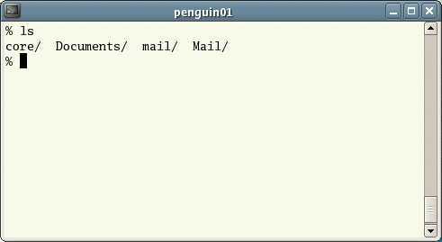
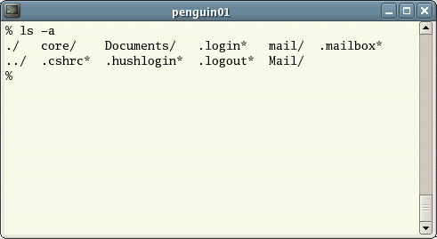

:tocdepth: 2

.. _session1:

*****************************************************
Session 1: Introduction to Linux
*****************************************************

The internet is `full of useful Linux tutorials
<http://lmgtfy.com/?q=linux+tutorial>`_; this is just one more, but
hopefully it will be brief yet thorough enough to learn the basics of
using Linux insofar as will be needed for the remainder of this
workshop.  The contents of this tutorial are adapted from an 
`online UNIX tutorial <http://www.ee.surrey.ac.uk/Teaching/Unix/>`_
by `Michael Stonebank <https://www.linkedin.com/in/mstonebank>`_.

.. sidebar:: Accessing Linux from Windows or OS X

   `Information on setting up a Linux emulator or terminal in Windows
   <http://faculty.smu.edu/reynolds/unixtut/windows.html>`_ 

   `Information on interactive with a Linux system from within OS X
   <http://faculty.smu.edu/reynolds/unixtut/osx.html>`_

   `Information on setting up a Linux virtual machine in any modern
   operating system <http://faculty.smu.edu/reynolds/unixtut/vm.html>`_

We'll break this session into five parts:

1. :ref:`intro_unix_os`
2. :ref:`unix_tutorial_1`
3. :ref:`unix_tutorial_2`
4. :ref:`unix_tutorial_3`
5. :ref:`unix_tutorial_4`

.. _intro_unix_os:

Introduction to the Linux Operating System
---------------------------------------------

What is UNIX/Linux?
^^^^^^^^^^^^^^^^^^^^^

UNIX is an operating system which was first developed in the 1960s,
and has been under constant development ever since. By operating
system, we mean the suite of programs which make the computer work. It
is a stable, multi-user, multi-tasking system for servers, desktops
and laptops. 

UNIX systems also have a graphical user interface (GUI) similar to
Microsoft Windows which provides an easy to use environment. However,
knowledge of UNIX is required for operations which aren't covered by a
graphical program, or for when there is no windows interface
available, for example, in a ssh session. 

Types of UNIX
^^^^^^^^^^^^^^^^^

There are many different versions of UNIX, although they share common
similarities. The most popular varieties of UNIX are GNU/Linux and
MacOS X.  Within the "Linux" category there are a multitude of
flavors: Debian (Ubuntu, Mint, Crunchbang), RedHat (RHEL, Fedora,
CentOS), SuSE, etc.

The UNIX operating system
^^^^^^^^^^^^^^^^^^^^^^^^^^^^^

The UNIX operating system is made up of three parts; the kernel, the
shell and the programs. 

The :index:`kernel`
"""""""""""""""""""""""

The kernel of UNIX is the hub of the operating system: it allocates
time and memory to programs and handles the filestore and
communications in response to system calls. 

As an illustration of the way that the shell and the kernel work
together, suppose a user types 

.. code-block:: bash

   $ rm myfile

(which has the effect of removing the file ``myfile``). The shell
searches the filestore for the file containing the program ``rm``, and
then requests the kernel, through system calls, to execute the program
``rm`` on ``myfile``. When the process ``rm myfile`` has finished
running, the shell then returns the UNIX prompt ``$`` to the user,
indicating that it is waiting for further commands.  

The :index:`shell`
""""""""""""""""""""

The shell acts as an interface between the user and the kernel. When a
user logs in, the login program checks the username and password, and
then starts another program called the shell. The shell is a command
line interpreter (CLI). It interprets the commands the user types in
and arranges for them to be carried out. The commands are themselves
programs: when they terminate, the shell gives the user another
prompt. 

The adept user can customize his/her own shell, and users can use
different shells on the same machine. Users will typically have the
:index:`TCSH` shell or :index:`BASH` shell by default (BASH is
typically the default on modern Linux distributions). 

These shells have certain features to help the user inputting
commands: 

* **Filename Completion** - By typing part of the name of a command,
  filename or directory and pressing the [Tab] key, the ``tcsh`` and
  ``bash`` shells will complete the rest of the name automatically. If
  the shell finds more than one name beginning with those letters you
  have typed, it will beep, prompting you to type a few more letters
  before pressing the [Tab] key again. 

* **History** - The shell keeps a list of the commands you have typed
  in. If you need to repeat a command, use the cursor keys to scroll
  up and down the list or type history for a list of previous
  commands. 

Files and processes
^^^^^^^^^^^^^^^^^^^^^^^^^^^^^

Everything in UNIX is either a file or a process.

A process is an executing program identified by a unique PID (process
identifier). 

A file is a collection of data. They are created by users using text
editors, running compilers etc. 

Examples of files:

* a document (report, essay etc.)
* the text of a program written in some high-level programming
  language 
* instructions comprehensible directly to the machine and
  incomprehensible to a casual user, for example, a collection of
  binary digits (an executable or binary file); 
* a directory, containing information about its contents, which may be
  a mixture of other directories (subdirectories) and ordinary files. 

The Directory Structure
^^^^^^^^^^^^^^^^^^^^^^^^^^^^^

All the files are grouped together in the directory structure. The file-system is arranged in a hierarchical structure, like an inverted tree. The top of the hierarchy is traditionally called *root* (written as a slash ``/``)

.. figure:: figs/unix-tree.png
   :scale: 100%
   :align: center

   UNIX directory structure example

In the diagram above, we see that the directory ``ee51vn`` contains
two sub-directories (``docs`` and ``pics``) and a file called
``report.doc``. 

The full path to the file ``report.doc`` is ``/home/its/ug1/ee51vn/report.doc``.

.. _unix_tutorial_1:

Moving Around the Filesystem
---------------------------------------------

Listing files and directories
^^^^^^^^^^^^^^^^^^^^^^^^^^^^^^^^^^^

:index:`ls (list)`
"""""""""""""""""""""

When you first login, your current working directory is your home
directory. Your home directory has the same name as your user-name,
e.g. ``dreynolds``, and it is where your personal files and
subdirectories are saved. 

To find out what is in your home directory, type

.. code-block:: bash

   $ ls

The ``ls`` command lists the contents of your current working
directory.

   Unix Terminal - running the ``ls`` command

There may be no files visible in your home directory, in which case,
the UNIX prompt will be returned. Alternatively, there may already be
some files inserted by the System Administrator when your account was
created. 

``ls`` does not, in fact, cause all the files in your home directory
to be listed, but only those ones whose name does not begin with a dot
(.) Files beginning with a dot (.) are "hidden" files and usually
contain important program configuration information. They are hidden
because you should not change them unless you are very familiar with
UNIX. 

To list all files in your home directory including those whose names
begin with a dot, type 

.. code-block:: bash

   $ ls -a

As you can see, ``ls -a`` lists files that are normally hidden.

   Unix Terminal - running the ``ls -a`` command

``ls`` is an example of a command which can take options: ``-a`` is an
example of an option. The options change the behaviour of the
command. There are online manual pages that tell you which options a
particular command can take, and how each option modifies the
behaviour of the command. (See later in this tutorial).

Making Directories
^^^^^^^^^^^^^^^^^^^^^^^^^^^^^^^^^^^

:index:`mkdir (make directory)`
"""""""""""""""""""""""""""""""""

We will now make a subdirectory in your home directory to hold the
files you will be creating and using in the course of this
tutorial. To make a subdirectory called ``unixstuff`` in your current
working directory type 

.. code-block:: bash

   $ mkdir unixstuff

To see the directory you have just created, type

.. code-block:: bash

   $ ls

Or to see what is inside of the directory ``unixstuff``, type

.. code-block:: bash

   $ ls unixstuff

Changing to a different directory 
^^^^^^^^^^^^^^^^^^^^^^^^^^^^^^^^^^^

:index:`cd (change directory)`
"""""""""""""""""""""""""""""""

The command ``cd directory`` means change the current working
directory to ``directory``. The current working directory may be
thought of as the directory you are in, i.e. your current position in
the file-system tree. 

To change to the directory you have just made, type

.. code-block:: bash

   $ cd unixstuff

Type ``ls`` to see the contents (which should be empty).

Exercise
"""""""""""""""""""""""""

Make another directory inside the ``unixstuff`` directory called
``backups``.

The directories . and ..
^^^^^^^^^^^^^^^^^^^^^^^^^^^^^^^^^^^

While still in the ``unixstuff`` directory, type

.. code-block:: bash

   $ ls -a

As you can see, in the ``unixstuff`` directory (and in all other
directories), there are two special directories called ``.`` and
``..``

:index:`. <. (the current directory)>`
""""""""""""""""""""""""""""""""""""""""""""""""""""""""""""

In UNIX, ``.`` means the current directory, so typing

.. code-block:: bash

   $ cd .

.. note:: there is a space between ``cd`` and ``.``

means stay where you are (in the ``unixstuff`` directory).

This may not seem very useful at first, but using ``.`` as the name of
the current directory will save a lot of typing, as we shall see later
in the tutorial. 

:index:`.. (the parent directory)`
""""""""""""""""""""""""""""""""""""

The other "special" directory in UNIX, ``..``, refers to the parent of the
current directory, so typing 

.. code-block:: bash

   $ cd ..

will take you one directory up the hierarchy (back to your home directory). Try it now.

.. note:: typing ``cd`` with no argument always returns you to your
	  home directory. This is very useful if you somehow get lost
	  in the file-system. 

Pathnames
^^^^^^^^^^^^^^^^^^^^^^^^^^^^^^^^^^^

:index:`pwd (print working directory)`
""""""""""""""""""""""""""""""""""""""""

Pathnames enable you to work out where you are in relation to the
whole file-system. For example, to find out the absolute pathname of
your home-directory, type ``cd`` to get back to your home-directory and
then type 

.. code-block:: bash

   $ pwd

which should give you something like this,

.. code-block:: bash

   /users/dreynolds

Suppose you were on the computer from our example UNIX directory
structure figure (reproduced again below). There, typing ``pwd`` in
the ``ee51vn`` sub-directory would produce 

.. code-block:: bash

   /home/its/ug1/ee51vn

which means that ``ee51vn`` is in the sub-directory ``ug1``, which in turn is located in the ``its`` sub-directory, which is in the ``home`` sub-directory, which is in the top-level root directory called ``/``.

.. figure:: figs/unix-tree.png
   :scale: 100%
   :align: center

   UNIX directory structure example

Exercise
""""""""""""""""""""""""""""""""""

Use the commands ``cd``, ``ls`` and ``pwd`` to explore the file-system.

(Remember, if you get lost, type ``cd`` by itself to return home).

More about home directories and pathnames
^^^^^^^^^^^^^^^^^^^^^^^^^^^^^^^^^^^^^^^^^^^

Understanding pathnames
""""""""""""""""""""""""""""""""""

Go back to your home-directory and then type

.. code-block:: bash

   $ ls unixstuff

to list the contents of your unixstuff directory.  Now type

.. code-block:: bash

   $ ls backups

You will get a message like this 

.. code-block:: bash

   /bin/ls: cannot access backups: No such file or directory

The reason is, ``backups`` is not in your current working
directory. To use a command on a file (or directory) not in the
current working directory (the directory you are currently in), you
must either ``cd`` to the correct directory, or specify its full
pathname. To list the contents of the ``backups`` directory that we
made earlier, you must instead type

.. code-block:: bash

   $ ls unixstuff/backups

 

:index:`~ (your home directory)`
"""""""""""""""""""""""""""""""""""

Home directories can also be referred to by the tilde character,
``~``. It can be used to specify paths starting at your home
directory. So typing 

.. code-block:: bash

   $ ls ~/unixstuff

will list the contents of your ``unixstuff`` directory, *no matter
where you currently are in the file-system*. 

What do you imagine that

.. code-block:: bash

   $ ls ~

would list?  What do you think that

.. code-block:: bash

   $ ls ~/..

would list?

Moving around the filesystem -- summary
^^^^^^^^^^^^^^^^^^^^^^^^^^^^^^^^^^^^^^^^^^^^

============  ======================================================
Command       Meaning
============  ======================================================
ls            list files and directories
ls -a         list all files and directories (including hidden ones)
mkdir         make a directory
cd directory  change to named directory
cd            change to home-directory
cd ~          change to home-directory
cd ..         change to parent directory
pwd           display the path of the current directory
============  ======================================================

.. _unix_tutorial_2:

Manipulating Files and Directories
------------------------------------------------

Copying Files
^^^^^^^^^^^^^^^^^^^^^^^^^^^^^^^^^^^^^^^^^^^

:index:`cp (copy)`
"""""""""""""""""""""""""""""

``cp file1 file2`` is the command which makes a copy of ``file1`` in
the current working directory and calls it ``file2``. 

What we are going to do now, is to take a file stored in an open
access area of the file system, and use the ``cp`` command to copy it
to your ``unixstuff`` directory. 

First, go to your ``unixstuff`` directory.

.. code-block:: bash

   $ cd ~/unixstuff

Then at the UNIX prompt, type,

.. code-block:: bash

   $ cp /usr/include/sys/types.h types.h

The above command means copy the file ``types.h`` from the
``/usr/include/sys`` directory to the current directory, keeping the
name the same. 

You can accomplish the same thing by typing

.. code-block:: bash

   $ cp /usr/include/sys/types.h .

Like the previous command, it directs the computer to copy the file
``types.h`` from the ``/usr/include/sys`` directory to the current
directory, ``.``, without changing the file name. 

Exercise
"""""""""""""""""""""""""""""

Create a backup of your ``types.h`` file by copying it to a file called ``types.bak``.

Moving files
^^^^^^^^^^^^^^^^^^^^^^^^^^^^^^^^^^^^^^^^^^^

:index:`mv (move)`
"""""""""""""""""""""""""""""

To move a file from one place to another, use the ``mv`` command. This
has the effect of moving rather than copying the file, so you end up
with only one file rather than two. The calling sequence is of the
form ``mv file1 file2`` which results in moving ``file1`` to
``file2``. 

This can be helpful when moving a file from one directory to
another. We are now going to move the file ``types.bak`` to your ``backup``
directory. 

First, change directories to your ``unixstuff`` directory (can you
remember how?). Then, inside the ``unixstuff`` directory, type 

.. code-block:: bash

   $ mv types.bak backups/.

Type ``ls`` and ``ls backups`` to see if it has worked.

The ``mv`` command can also be used to rename a file, by moving the
file to the same directory, but giving it a different filename. 

Removing files and directories
^^^^^^^^^^^^^^^^^^^^^^^^^^^^^^^^^^^^^^^^^^^

:index:`rm (remove)`, :index:`rmdir (remove directory)`
""""""""""""""""""""""""""""""""""""""""""""""""""""""""""

To delete (remove) a file, use the ``rm`` command. As an example, we are going to create a copy of the ``types.h`` file then delete it.

Inside your ``unixstuff`` directory, type

.. code-block:: bash

   $ cp types.h tempfile.txt
   $ ls
   $ rm tempfile.txt
   $ ls

(after ``rm tempfile.txt`` you may need to answer "y" at the prompt
and hit [Enter] before continuing).  

These commands first copied the file ``types.h`` to a copy called
``tempfile.txt``, then showed you the list of files in this directory
(notice the new file), then deleted ``tempfile.txt``, and finally
showed you the updated list of files in this directory. 

You can use the ``rmdir`` command to remove a directory (make sure it
is empty first). Try to remove the ``backups`` directory: 

.. code-block:: bash

   $ rmdir backups

Notice that you cannot remove the directory, since UNIX will not let
you remove a non-empty directory. 

Exercise
""""""""""""""""""""""""""""""""""""""""""

Create a directory called ``tempstuff`` using ``mkdir``, then remove
it using the ``rmdir`` command. 

Displaying the contents of a file on the screen
^^^^^^^^^^^^^^^^^^^^^^^^^^^^^^^^^^^^^^^^^^^^^^^^^

:index:`clear (clear screen)`
""""""""""""""""""""""""""""""""""""""""""

Before you start the next section, you may want to clear the terminal
window of the previous commands so the output of the following
commands can be clearly understood. 

At the prompt, type

.. code-block:: bash

   $ clear

This will clear all text and leave you with the ``$`` prompt at the
top of the window. 

 

:index:`cat (concatenate)`
""""""""""""""""""""""""""""""""""""""""""

The command ``cat`` can be used to display the contents of a file to
the screen. Type: 

.. code-block:: bash

   $ cat types.h

As you can see, the file is longer than than the size of the window,
so it scrolls past making it difficult to read the file from the
beginning. 

 

:index:`less (view file contents)`
""""""""""""""""""""""""""""""""""""""""""

The command less writes the contents of a file onto the screen one
page at a time. Type 

.. code-block:: bash

   $ less types.h

Press the [space-bar] if you want to see another page, and type [q] if
you want to quit reading. 

As you can see, ``less`` can be more useful for reading long files
than ``cat``. 

 

:index:`head (view top of file)`
""""""""""""""""""""""""""""""""""""""""""

The ``head`` command writes the first ten lines of a file to the screen.

First clear the screen then type

.. code-block:: bash

   $ head types.h

Then type

.. code-block:: bash

   $ head -3 types.h

What difference did the -3 do to the ``head`` command?

 

:index:`tail (view bottom of file)`
""""""""""""""""""""""""""""""""""""""""""

The ``tail`` command writes the last ten lines of a file to the screen.

Clear the screen and type

.. code-block:: bash

   $ tail types.h

Q. Can you figure out how to view the last 15 lines of this file?

 

Searching the contents of a file
^^^^^^^^^^^^^^^^^^^^^^^^^^^^^^^^^^^^^^^^^^^

Simple searching using less
""""""""""""""""""""""""""""""""""""""""""

Using ``less``, you can search though a text file for a keyword
(pattern). For example, to search through ``types.h`` for the word
``long``, type 

.. code-block:: bash

   $ less types.h

then, still in less, type a forward slash [/] followed by the word you want to search for,

.. code-block:: bash

   /long

As you can see, ``less`` finds and highlights the keyword. Type [n] to
search for the next occurrence of the word. Type [q] to quit the
search. 

 

:index:`grep <grep (file search)>` (don't ask why it is called grep)
"""""""""""""""""""""""""""""""""""""""""""""""""""""""""""""""""""""

``grep`` is one of many standard UNIX utilities. It searches files for
specified words or patterns. First clear the screen, then type 

.. code-block:: bash

   $ grep long types.h

As you can see, ``grep`` has printed out each line of the file
``types.h`` that contains the word long. 

Or has it ????

Try typing

.. code-block:: bash

   $ grep LONG types.h

Note that the ``grep`` command is case sensitive; it distinguishes
between ``LONG`` and ``long``. 

To ignore upper/lower case distinctions, use the ``-i`` option,
i.e. type 

.. code-block:: bash

   $ grep -i long types.h

To search for a phrase or pattern, you must enclose it in single
quotes (the apostrophe symbol). For example to search for ``long int``
you would type 

.. code-block:: bash

   $ grep -i 'long int' types.h

Some of the other options of grep are:

  ``-v``  display those lines that do NOT match 
 
  ``-n``  precede each matching line with the line number 

  ``-c``  print only the total count of matched lines 

Try some of them and see how the results differ. Don't forget, you can
combine options to do more than just one thing at a time. For example,
the number of lines without the words ``long`` or ``LONG`` is 

.. code-block:: bash

   $ grep -ivc long types.h

 

:index:`wc (word count)`
""""""""""""""""""""""""""""""""""""""""""

A handy little utility is the ``wc`` command, short for *word
count*. To do a word count on ``types.h``, type 

.. code-block:: bash

   $ wc -w types.h

To find out how many lines the file has, type

.. code-block:: bash

   $ wc -l types.h

Manipulating files and directories -- summary
^^^^^^^^^^^^^^^^^^^^^^^^^^^^^^^^^^^^^^^^^^^^^^^^

========================= =================================================
Command                   Meaning
========================= =================================================
cp file1 file2            copy file1 and call it file2
mv file1 file2            move or rename file1 to file2
rm file                   remove a file
rmdir directory           remove a directory
cat file                  display a file
less file                 display a file a page at a time
head file                 display the first few lines of a file
tail file                 display the last few lines of a file
grep 'keyword' file       search a file for keywords
wc file                   count number of lines/words/characters in file
========================= =================================================

.. _unix_tutorial_3:

Redirection, Pipes, Wildcards and Getting Help
-----------------------------------------------------------

Redirection  
^^^^^^^^^^^^^^^^^^^^^^^^^^^^^^^^^^^

Most processes initiated by UNIX commands write to the standard output
(that is, they write to the terminal screen), and many take their
input from the standard input (that is, they read it from the
keyboard). There is also the standard error, where processes write
their error messages, by default, to the terminal screen. 

We have already seen one use of the ``cat`` command to write the
contents of a file to the screen. 

Now type ``cat`` without specifing a file to read

.. code-block:: bash

   $ cat

Then type a few words on the keyboard and press the [Return] key.

Finally hold the [Ctrl] key down and press [d] (written as ``^D`` for
short) to end the input. 

What has happened?

If you run the ``cat`` command without specifing a file to read, it
reads from *standard input* (the keyboard), and on receiving the 'end
of file' character (``^D``), copies the input to *standard output*
(the screen).  

In UNIX, we can redirect both the standard input (*stdin*) and the
standard output (*stdout*) of commands.

:index:`Redirecting the Output <> (redirecting output)>`
^^^^^^^^^^^^^^^^^^^^^^^^^^^^^^^^^^^^^^^^^^^^^^^^^^^^^^^^^^^

We use the ``>`` symbol to redirect the output of a command. For
example, to create a file called ``list1`` containing a list of fruit,
type

.. code-block:: bash

   $ cat > list1

Then type in the names of some fruit. Press [Return] after each one.

.. code-block:: bash

   pear
   banana
   apple
   ^D        # this means press [Ctrl] and [d] to stop

What happens is the ``cat`` command reads the standard input (the
keyboard) and the ``>`` redirects the output, which normally goes to
the screen, into a file called ``list1`` 

To read the contents of the new file, use ``cat`` or ``less``.

Exercise
""""""""""""""

Using the above method, create another file called ``list2``
containing the following fruit: orange, plum, mango, grapefruit. Read
the contents of the new file, ``list2``. 

 

:index:`Appending to a file <>> (appending output)>`
""""""""""""""""""""""""""""""""""""""""""""""""""""""

The double greater-than symbol ``>>`` appends standard output to a
file. So to add more items to the existing file ``list1``, type 

.. code-block:: bash

   $ cat >> list1

Then type in the names of more fruit

.. code-block:: bash

   peach
   grape
   orange
   ^D

To read the contents of the file, type

.. code-block:: bash

   $ cat list1

You should now have two files: ``list1`` contains six fruit, while
``list2`` contains four.

We will now use the ``cat`` command to join (concatenate) ``list1``
and ``list2`` into a new file called ``biglist``. Type 

.. code-block:: bash

   $ cat list1 list2 > biglist

What this is doing is reading the contents of both files ``list1`` and
``list2`` in turn, then outputing the text to the file ``biglist`` 

To read the contents of this new file, type

.. code-block:: bash

   $ cat biglist

:index:`Redirecting the Input << (redirecting input)>`
^^^^^^^^^^^^^^^^^^^^^^^^^^^^^^^^^^^^^^^^^^^^^^^^^^^^^^^^

We use the ``<`` symbol to redirect the input of a command.

The command ``sort`` alphabetically or numerically sorts a list. Type

.. code-block:: bash

   $ sort

Then type in the names of some animals. Press [Return] after each one.

.. code-block:: bash

   dog
   cat
   bird
   ape
   ^D

The output will be

.. code-block:: bash

   ape
   bird 
   cat 
   dog

Using ``<`` you can redirect the input to come from a file rather than
the keyboard. For example, to sort the list of fruit, type 

.. code-block:: bash

   $ sort < biglist

and the sorted list will be output to the screen.

To output the sorted list to a file, type

.. code-block:: bash

   $ sort < biglist > slist

Use ``cat`` to read the contents of the newly-created file ``slist``.

:index:`Pipes <| (pipes)>`
^^^^^^^^^^^^^^^^^^^^^^^^^^^^^^^^^^^

To see who is logged into the system along with you, type

.. code-block:: bash

   $ who

One method to get a sorted list of those names is to type,

.. code-block:: bash

   $ who > names.txt
   $ sort < names.txt

This is a bit slow (two whole steps) and you have to remember to
remove the temporary file ``names`` when you have finished.  As truly
lazy/efficient technophiles, what you really want to do is connect the
output of the ``who`` command directly to the input of the ``sort``
command. This is exactly what pipes do. The symbol for a pipe is the
vertical bar ``|``. 

For example, typing

.. code-block:: bash

   $ who | sort

will give the same result as above, but quicker and cleaner.

To find out how many users are logged on, you can type

.. code-block:: bash

   $ who | wc -l

Exercise
"""""""""""""""

Using two pipes, display all lines of ``list1`` and ``list2`` containing
the letter "p", and sort the result. 

Wildcards
^^^^^^^^^^^^^^^^^^^^^^^^^^^^^^^^^^^

The :index:`* <* (wildcard)>` wildcard
""""""""""""""""""""""""""""""""""""""""

The character ``*`` is called a *wildcard*, and will match against
none or more character(s) in a file (or directory) name. For example,
in your ``unixstuff`` directory, type 

.. code-block:: bash

   $ ls list*

This will list all files in the current directory starting with the characters "list"

Try typing

.. code-block:: bash

   $ ls *list

This will list all files in the current directory ending with "list"

The :index:`? <? (wildcard)>` wildcard
"""""""""""""""""""""""""""""""""""""""

The character ``?`` will match exactly one character, So ``?ouse``
will match files like ``house`` and ``mouse``, but not ``grouse``. 

Try typing

.. code-block:: bash

   $ ls ?list

 

Filename conventions
^^^^^^^^^^^^^^^^^^^^^^^^^^^^^^^^^^^

We should note here that a directory is merely a special type of
file. So the rules and conventions for naming files apply also to
directories. 

In naming files, characters with special meanings such as ``/``,
``*``, ``&``, ``%`` and ``,`` should be avoided. Also, it is best to
avoid using spaces within names. The safest way to name a file is to
use only alphanumeric characters, that is, letters and numbers,
together with ``_`` (underscore) and ``.`` (dot).

=================  ===============
Good filenames     Bad filenames
=================  ===============
project.txt        project
my_big_program.c   my big program.c
fred_dave.doc      fred & dave.doc
=================  ===============

File names conventionally end with a dot followed by a group of
letters indicating the contents of the file, although this is not at
all required in Linux.  For example, all files consisting of C code
may be named with the ending .c, for example, ``prog1.c``. Then in order
to list all files containing C code in your home directory, you need
only type ``ls ~/*.c``

Getting Help
^^^^^^^^^^^^^^^^^^^^^^^^^^^^^^^^^^^

On-line Manuals
"""""""""""""""""""

There are built-in manuals which give information about most
commands. The :index:`manual pages <man (manual)>` tell you which options a
particular command can take, and how each option modifies the
behaviour of the command. Type "man *command*" to read the manual page
for a particular *command*. 

For example, to find out more about the ``wc`` (word count) command, type

.. code-block:: bash

   $ man wc

Alternatively

.. code-block:: bash

   $ whatis wc

gives a :index:`one-line description <whatis (brief manual)>` of the
command, but omits any information about options etc. 

:index:`Apropos <apropos (command search)>`
"""""""""""""""""""""""""""""""""""""""""""""""

When you are not sure of the exact name of a command, "apropos
*keyword*" will give you the commands with *keyword* in their manual
page header. For example, try typing 

.. code-block:: bash

   $ apropos copy

Redirection, pipes, wildcards and help -- summary
^^^^^^^^^^^^^^^^^^^^^^^^^^^^^^^^^^^^^^^^^^^^^^^^^^^^

========================     =======================================================
Command                      Meaning
========================     =======================================================
command > file               redirect standard output to a file
command >> file              append standard output to a file
command < file               redirect standard input from a file
command1 | command2          pipe the output of command1 to the input of command2
cat file1 file2 > file0      concatenate file1 and file2 to file0
sort                         sort data
who                          list users currently logged in
\*                            match any number of characters
?                            match one character
man command                  read the online manual page for a command
whatis command               brief description of a command
apropos keyword              match commands with keyword in their man pages
========================     =======================================================

.. _unix_tutorial_4:

Permissions and Security
--------------------------------------

File system security (access rights)
^^^^^^^^^^^^^^^^^^^^^^^^^^^^^^^^^^^^^^^

In your ``unixstuff`` directory, type

.. code-block:: bash

   $ ls -l

The ``-l`` stands for 'long' listing. You will see that you now get
lots of details about the contents of your directory, similar to the
example below. 

.. figure:: figs/permissions.gif
   :scale: 130%
   :align: center

   File and directory access rights

Each file (and directory) has associated access rights, which may be
found by typing ``ls -l``. Also, ``ls -lg`` gives additional
information as to which group owns the file (``beng95`` in the
following example): 

.. code-block:: bash

   -rwxrw-r-- 1 ee51ab beng95 2450 Sept29 11:52 file1

In the left-hand column is a 10 symbol string consisting of the
symbols ``d``, ``r``, ``w``, ``x``, ``-``, and, occasionally, ``s`` or
``S``. If ``d`` is present, it will be at the left hand end of the
string, and indicates a directory: otherwise ``-`` will be the
starting symbol of the string. 

The 9 remaining symbols indicate the permissions, or access rights,
and are taken as three groups of 3. 

* The left group of 3 gives the file permissions for the user that
  owns the file (or directory) (``ee51ab`` in the above example);  
* the middle group gives the permissions for the group of people to
  whom the file (or directory) belongs (``eebeng95`` in the above
  example); 
* the rightmost group gives the permissions for all other users.

The symbols ``r``, ``w``, etc., have slightly different meanings
depending on whether they refer to a simple file or to a directory. 

Access rights on files
""""""""""""""""""""""""""

* ``r`` (or ``-``), indicates read permission (or otherwise), that is,
  the presence or absence of permission to read and copy the file
* ``w`` (or ``-``), indicates write permission (or otherwise), that
  is, the permission (or otherwise) to change a file  
* ``x`` (or ``-``), indicates execution permission (or otherwise),
  that is, the permission to execute/run a file, where appropriate 

Access rights on directories
""""""""""""""""""""""""""""""""

* ``r`` allows users to list files in the directory
* ``w`` means that users may delete files from the directory or move
  files into it
* ``x`` means the right to access files in the directory. This implies
  that you may read files in the directory provided you have read
  permission on the individual files. 

So, in order to read a file, you must have execute permission on the
directory containing that file, and hence on any directory containing
that directory as a subdirectory, and so on, up the tree. 

Some examples
""""""""""""""""""

==============  ========================================================================================================================================
Permissions     Meaning
==============  ========================================================================================================================================
``-rwxrwxrwx``	a file that everyone can read, write and execute (and delete)
``-rw-------``	a file that only the owner can read and write - no-one else can read or write and no-one has execution rights (e.g. your mailbox file)
``drwxr-x---``	a directory that the owner can read/write/enter, that the group can read/enter, but others are denied access
``drwx--x--x``	a directory that the owner may read/write/enter, and all others can enter (but do nothing else)
==============  ========================================================================================================================================

Changing access rights
^^^^^^^^^^^^^^^^^^^^^^^^^^^^^^^^^

:index:`chmod (change permissions)`
""""""""""""""""""""""""""""""""""""""""

Only the owner of a file can use ``chmod`` to change the permissions
of a file. The options of ``chmod`` are as follows 

======  =====================================
Symbol  Meaning
======  =====================================
u       user
g       group
o       other
a       all
r       read
w       write (and delete)
x       execute (and access directory)
+       add permission
-       take away permission
======  =====================================

For example, to remove read write and execute permissions on the file
``biglist`` for the group and others, type 

.. code-block:: bash

   $ chmod go-rwx biglist

This will leave the other permissions unaffected.

To give read and write permissions on the file ``biglist`` to all,

.. code-block:: bash

   $ chmod a+rw biglist

Alternatively, you may use a three-digit number to specify the access permissions. The numerical values for the permissions are

====  =====  =======
Read  Write  Execute
====  =====  =======
4     2      1
====  =====  =======

Add up the desired permissions for the user to form the first digit,
add up the desired permissions for the group to form the second digit,
and add up the desired permissions for others to form the third
digit. 

For example, to grant read and write permissions to the user (4+2=6),
read permissions (4) to the group, and no permissions to others (0),
for the file ``biglist``, use the command 

.. code-block:: bash

   $ chmod 640 biglist

Exercise
""""""""""""

Try changing access permissions on the file ``types.h`` and on the directory ``backups``.

Use ``ls -l`` to check that the permissions have changed.

.. raw:: html
   :file: counter.html

