:tocdepth: 2

.. _session8:

*****************************************************
Session 8: Introduction to Parallel Computing
*****************************************************

*Instructor: Dan Reynolds*

What is parallel computing?
================================================

Parallel computing has historically focused on state-of-the-art
engineering and scientific applications. Now video game consoles,
laptops and desktops have begun to transition toward chips with
multiple processors as well. 

.. index:: Moore's law

Motivation: Moore's law
--------------------------------------------------

Historically, we have depended on hardware advances to enable faster
and larger simulations.  In 1965, Gordon Moore observed that the CPU
and RAM transistor count about doubled each year. “Moore’s Law” has
since been revised to a doubling once every 2 years, with startling
accuracy. However physical limits, e.g. power consumption, heat
emission, and even the size of the atom, are making such advances more
difficult, and will eventually halt this expansion.

.. figure:: figs/Moore_law.png
   :scale: 90 %
   :align: center

   [from `Wikipedia -- Moore's Law
   <http://en.wikipedia.org/wiki/Moore%27s_law>`_]

.. index:: CPU vs memory/disk speed

Motivation: CPU vs memory/disk speed
--------------------------------------------------

* The overall rate of computation is determined not just by the
  processor speed, but also by the ability of the memory system to
  feed data to it. 

* Thanks to Moore’s law, clock rates of high-end processors have
  increased at roughly 40% per year over the last decade. 

* However, over that same time interval, RAM access times have
  improved at roughly 10% per year. 

* This growing mismatch between processor speed and RAM latency
  presents an increasing performance bottleneck, since the CPU spends
  more and more time waiting on data from RAM. 

Motivation: the parallel solution
--------------------------------------------------

In addition, many simulations require incredible amounts of memory to
achieve high-accuracy solutions (PDE & Monte-Carlo solvers, etc.),
which cannot fit on a single computer alone.

The natural solution to these problems is the use of parallel
computing:

* Use multiple processors concurrently to solve a problem in less
  time.

* Use multiple computers to store data for large problems.

.. index:: Gordon Bell Prize

The Gordon Bell Prize (below) is awarded to each year’s simulation
that achieves the highest FLOP rate:

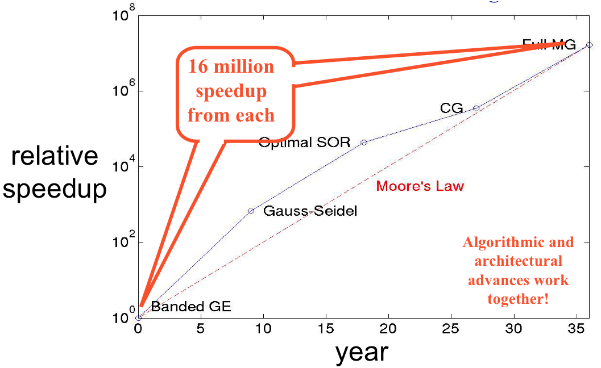

   [from David E. Keyes, HiPC 2007]

.. index:: Flynn's parallel architecture taxonomy, SIMD, MIMD, SISD, MISD

Flynn's parallel architecture taxonomy
--------------------------------------------------

We classify parallel computers according to their control structure along the
metrics:

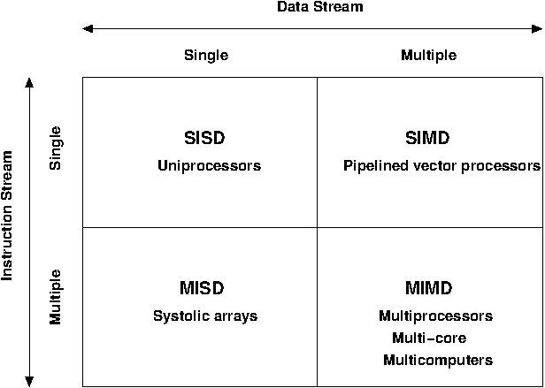

* Single/multiple instruction streams: how many types of instructions
  may be performed at once?

* Single/multiple data streams: how many data streams may be operated
  on at once?

* Most modern parallel computers (and personal comp.) are MIMD.

* SIMD was popular until 1990s.

* MISD never used to large extent.

Parallel computing hardware
================================================

We typically group parallel computing architectures into two primary
categories according to the memory layout on these machines: *shared
memory* and *distributed memory*.  However, modern parallel computing
facilities are in fact comprised of a hybrid between these two
categories. 

.. index:: multiprocessor, SMP

Parallel architectures: multiprocessors
--------------------------------------------------

In the 80’s, vendors began to attach multiple processors to the same
memory. 

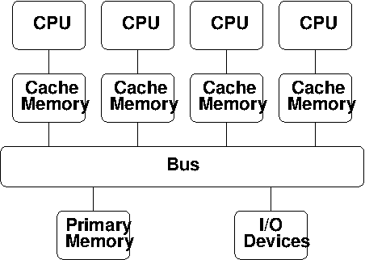

* Perhaps the most easily usable (but costliest) approach for
  parallelism. 

* Straightforward extension of uniprocessor: multiple CPUs are
  attached to the bus, all sharing the same primary memory, so the
  same memory address on different CPUs refers to the same memory
  location. 

* Also called a Shared Memory Parallel (SMP) computer.

* Processors interact and synchronize with each other through shared
  variables. 

* Local cache memory keeps CPUs busy; but can lead to cache coherency
  issues. 

* Performance is limited by bus bandwidth.

* Allows efficient use of at most a few dozen processors.

* Larger SMP systems exist, but rapidly become prohibitively
  expensive.

.. index:: multi-core

Parallel architectures: multi-core
--------------------------------------------------

Most modern computer processors employ multiple computational cores: 

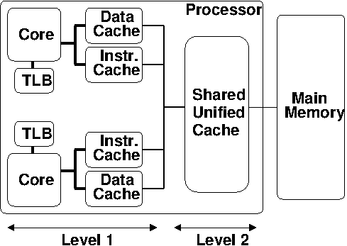

* Replicates much (but not all) of a processor’s logic on multiple
  chips. 

* Allows the processor to behave like a shared-memory parallel
  machine. 

* Each core has local cache: Data, Instruction and Address (TLB).

* These local caches are all at Level 1 (closest to the CPU). 

However, the cores *share* the unified L2 cache: 

* Typically much larger than L1 cache.

* Contains both instructions and data.

Limitations:

* Bus bandwidth (like SMPs).

* Slower effective cache bandwidth than SMPs, since L2 cache is
  shared. 

.. index:: multicomputer, DMP

Parallel architectures: multicomputers
--------------------------------------------------

A more cost-effective approach to construction of larger parallel
computers relies on a network to connect disjoint computers together:

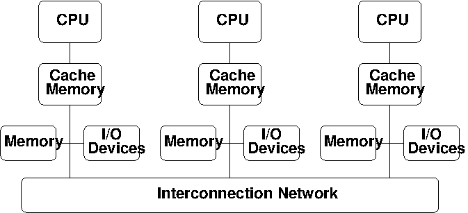

* Each processor only has direct access to its own local memory
  address space; the same address on different processors refers to
  different memory locations. 

* Processors interact with one another through passing messages.

* Commercial multicomputers typically provide a custom switching
  network to provide low-latency, high-bandwidth access between
  processors.

* Commodity clusters are build using commodity computers and
  switches/LANs. 

* Clearly less costly than SMP, but have increased latency/decreased
  bandwidth between CPUs.

* Construction may be *symmetric*, *asymmetric*, or *mixed*.

* Theoretically extensible to arbitrary processor counts, but software
  becomes complicated and networking gets expensive. 

Machine size history
--------------------------------------------------

Historical plot of the processor count in computers comprising the
Top500 list since 1993. 

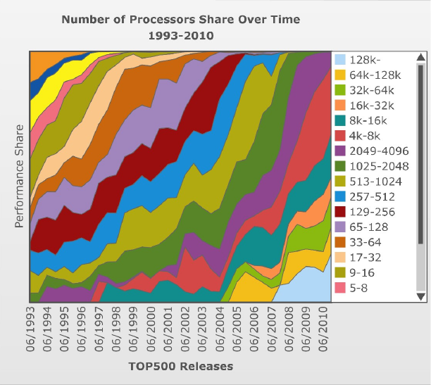

   (figure from `http://www.top500.org <http://www.top500.org>`_)

Note the trend to achieve performance advances through increases in parallelism.

Such rapid parallelism increases have put limitations on the parallel
architectures that may be used.

.. index:: parallel architecture history, MPP, Cluster, SMP, Constellation

History of parallel architectures
--------------------------------------------------

Historical plot of the computer architectures comprising the Top500
list since 1993: 

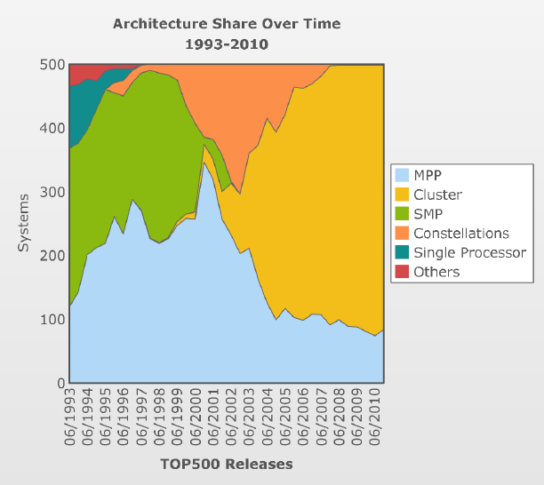

   (figure from `http://www.top500.org <http://www.top500.org>`_)

Definitions of terms above:

* MPP: Massively Parallel Processors (commercially-designed)

* Cluster: ‘loosely’ coupled commodity parts

* SMP: Shared Memory Parallel

* Constellations: Distributed group of SMP Machines

Note the extinction of large shared-memory machines, replaced by
distributed-memory MPP and Cluster machines.

.. code-block:: text

   "Anyone can build a fast CPU. The trick is to build a fast system."
   -- Seymour Cray 

.. index:: distributed parallel networks

Distributed parallel networks
--------------------------------------------------

Since clusters pass messages to communicate between CPUs, the speed of
a parallel computation inherently depends on the speed of the network.

* Networks can consist of simple LAN networks, or can be customized
  switches. 

* A shared medium (e.g. LAN) allows only one message at a time.
 
  * Each processor ‘listens’ to every message, receiving only those
    sent to it. 
  
  * To send a message, a processor must wait until the medium is
    unused. 

  * If two processors send at the same time, messages interfere and
    must re-send.

* Switched media support point-to-point messages among pairs of
  processors, with each processor having its own communication path to
  the switch. 

  * Allow concurrent transmission of messages between different
    processor pairs.

  * Support the scaling of the network to allow large numbers of
    processors. 

* Switched network topologies vary by computer: ring, mesh,
  binary-tree, hypertree, butterfly, hypercube and shuffle-exchange
  networks are all common.

.. index:: fast ethernet, gigabit ethernet, infiniband

Common switches for commodity clusters include:

* *Fast Ethernet*: 100 Mbit/sec bandwidth, 100 μsec latency

* *Gigabit Ethernet*: 1-10 Gbit/sec bandwidth, 100 μsec latency

* *Infiniband*: 40 Gbit/sec bandwidth, 1.07 μsec latency

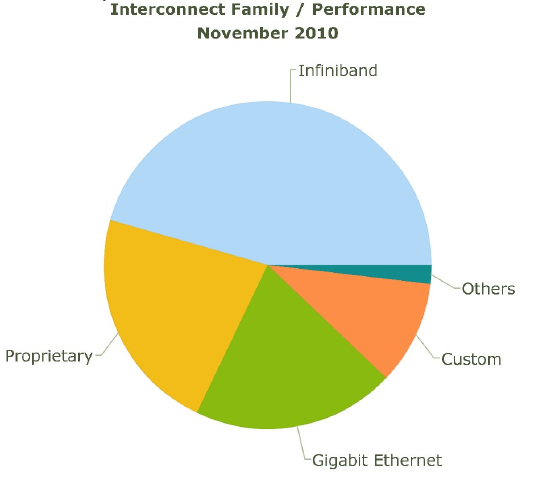

   (figure from `http://www.top500.org <http://www.top500.org>`_)

Compare these to on-computer speeds of:

* L1 cache: 700 Gbit/sec (Intel Sandybridge)

* L2 cache: 400 Gbit/sec (Intel Sandybridge)

* Memory bus: 168 Gbit/sec (PC3-1333 DDR3-SDRAM)

* Disk: 6 Gbit/sec (SATA-3)

   

.. index:: parallel computing paradigms

Parallel computing paradigms: shared vs distributed memory
=================================================================

The question then arises as to how we may use these parallel
computers.  There are a number of options:

* Auto-parallelizing compilers (easiest):

  * Automatically identify and parallelize existing sequential
    programs. 

  * Difficult to do well: although an algorithm may be inherently
    parallelizable, the compiler may have difficulty realizing the
    extent, and putting it into practice.

* Extend a sequential language (most popular):

  * Extend sequential programming languages with functions that allow
    creation, termination synchronization and communication of
    parallel processes.

  * May be developed as a subroutine library or compiler directives;
    thereby allowing reuse of the sequential language, compiler, and
    most code. 

* Create a new parallel language from scratch (High Performance
  Fortran, UPC, C*)

* Add a parallel programming layer: A separate parallel programming
  system calls sequential procedures to orchestrate the combined
  program. 

.. code-block:: text

   “I know how to make 4 hourses pull a cart – I don’t know how to make
   1024 chickens do it.” -- Enrico Clementi

.. index:: Jiffy Lube example

MIMD example -- the "Jiffy Lube" model
--------------------------------------------------

Jiffy Lube advertises a “12-point check”, consisting of changing the
oil and filter, interior vacuum, battery check, windshield wiper
check, brake fluid check, tire pressure check, etc.; 6 attendants
cooperate to do these tasks on each car.

* In *coarse-grained parallelism*, the major tasks are done in
  parallel. Here, the vacuuming, battery and fluid checks can be done
  while the oil is being changed.

* In *fine-grained parallelism*, tasks requiring similar processing
  are done in parallel – 4 attendants could each check the pressure of
  a tire. 

* *Data dependencies* arise when certain tasks must wait to be started
  until others have finished and their results are made available.

  * The oil cannot be refilled until the oil filter has been changed,
    creating a *coarse-grained data dependency*.

  * If a tire needs to be changed and 5 attendants are each assigned
    to tighten a different lug nut, they cannot proceed concurrently
    since the nuts must be tightened in a given order – a *fine-grained
    data dependency*. 

Other relevant MIMD definitions [and their Jiffy Lube equivalents]:

* *Data partitioning* – multiple but essentially identical processes
  each work on a portion of the data to be processed [check tire
  pressure or tighten lug nuts] 

* *Function partitioning* – multiple processes perform different kinds
  of tasks [one vacuums, another checks the battery, a third does the
  oil change] 

* *Prescheduled loops* – work distribution to multiple processors is
  fixed by the programmer in the code or by the compiler at compile
  time [Pete always checks the battery, Flo always does the oil
  change] 

* *Statically scheduled loops* – work distribution is fixed at run
  time. For example, it can depend on the number of processors [the
  first one to work in the morning gets to do wipers all day] 

* *Dynamically scheduled loops* – work distribution determined during
  execution, when a processor becomes available it takes the next item
  that needs work [once Frank finishes vacuuming, he does the next
  item on the checklist] 

General parallel computing definitions
--------------------------------------------------

.. index:: parallel decomposition

* *Partitioning/Decomposition*: the means by which an overall
  computation is divided into smaller parts, some or all of which may
  be executed in parallel. 

.. index:: parallel tasks

* *Tasks*: programmer-defined computational subunits determined
  through the decomposition.

.. index:: parallel concurrency

* *Concurrency*: the degree to which multiple tasks can be executed in
  parallel at any given time (more is better).

.. index:: parallel granularity

* *Granularity*: the size of tasks into which a problem is decomposed 

  * A decomposition into a large number of small tasks is called
    *fine-grained*. 

  * A decomposition into a small number of large tasks is called
    *coarse-grained*. 

.. index:: parallel task interaction

* *Task-interaction*: the tasks that a problem is decomposed into
  often share input, output, or intermediate data that must be
  communicated.

.. index:: parallel processes

* *Processes*: individual threads of execution. A single processor may
  execute multiple processes, each of which can operate on multiple
  tasks. 

The primary question in parallel algorithms -- decomposition
----------------------------------------------------------------

Any decomposition strategy must determine a set of primitive tasks.

*Goals*:

* Identify as many primitive tasks as possible (increases potential
  parallelism): prefer at least an order of magnitude more tasks than
  processors. 

* Minimize redundant computations and data storage (efficiency,
  scalability). 

* Want primitive tasks to be roughly equal work (load balancing).

* Want the number of tasks to increase as the problem gets larger
  (scalability). 

*Data decompositions* are approaches that first divide the data into
pieces and then determine how to associate computations with each
piece of data. 

*Functional decompositions* are approaches that first divide the
computation into functional parts and then determine how to associate
data items with the individual computations.

Overhead and load balancing
--------------------------------------------------

After decomposition, we must map tasks onto processes with the goal
that all tasks finish in the shortest time.

.. index:: overhead

We strive to minimize *overheads* for executing the tasks, including:

* The time spent communicating between processors,

* The time some processors spend sitting idle,

* The time spent in the spawning of new threads.

Idle processes occur due to:

* An uneven load distribution,

* Unresolved dependencies from an earlier parallel task set,

* A heterogeneous machine, where processors operate at different
  speeds.

.. index:: load balancing

*Load balancing* is the attempt to map processes with the dual
objectives: 

* Reduce the amount of inter-processor communication.

* Reduce the amount of time some processors are idle while others are
  working. 

This can be a non-trivial task, since these two objectives usually 
conflict with each other. 

Data decompositions
------------------------------------

.. index:: parallel decomposition; domain decomposition

Domain decomposition
^^^^^^^^^^^^^^^^^^^^^^^^^^^^^^^^^^^^^^^^^^^^^^^^^^^^^^

* Tasks are statically or semi-statically mapped onto processes based on
  spatial location; each task performs similar operations on different
  data (subdomains).

* Work is interspersed with communication to synchronize the tasks or
  share data.

* The degree of parallelism increases with problem size, enabling
  effective use of more processes on larger problems.

Typical domain decomposition approaches:

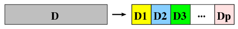

   1D -- decompose processes along a single physical dimension.

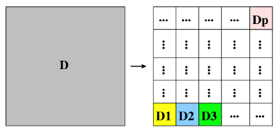

   2D -- decompose processes along two physical dimensions; this
   typically requires a logically-rectangular physical domain.

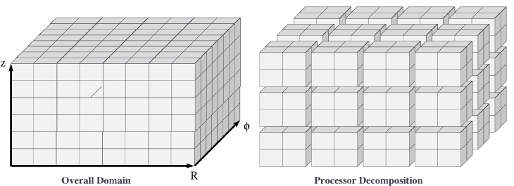

   3D -- decompose processes along three physical dimensions;
   typically requires a logically-cuboid physical domain.

Domain decomposition example: PDE approximation of an aircraft
""""""""""""""""""""""""""""""""""""""""""""""""""""""""""""""""""

Suppose we want to simulate 3D elasticity for vibrations/deformations
in an aircraft.

* A relevant domain decomposition of the problem could be:

  * Process 0 solves the model over the fuselage,

  * Process 1 solves the model over the left wing,

  * Process 2 solves the model over the right wing,

  * Process 3 solves the model over the tail.

* The processes must communicate to send relevant data about how the
  fuselage interacts with the wings and tail. 

* Not all processes need to communicate – only those who own adjacent
  parts of the plane.

* If the wing deformations are greater than the tail, computations on
  processes 1 and 2 could take longer than process 3.

.. index:: parallel decomposition; work pool

Work pool model
^^^^^^^^^^^^^^^^^^^^^^^^^^^^^^^^^^^^^^^^^^^^^^^^^^^^^^

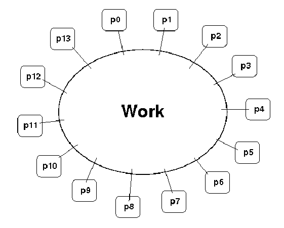

* Tasks are dynamically mapped onto processes, where any task may
  potentially be performed by any process. 

* Useful for load balancing if individual tasks may take dramatically
  different amounts of time. 

* Typical when the data is small compared to the computation
  associated with tasks, and/or there are *many* more tasks than
  processes. 

Work pool example: particle dynamics
""""""""""""""""""""""""""""""""""""""""""""""""""""""""""""""""""

Suppose we wish to simulate the dynamics (position and velocity) of a
large number of collisionless particles in an external force field,
and where particles with a greater speed require increased processing.

* This model first divides the overall set into a large number of
  subsets [e.g. each particle, or small packets of particles].

* Each process begins work on evolving a different subset of
  particles. 

* When each task finishes with their set, they begin work on another
  set, until all of the sets of particles have been processed. 

* The granularity of tasks can be adjusted to trade-off between load
  imbalance and the overhead of accessing the queue of remaining
  particles. 

* The pool may be stored in a physically-shared list, or some
  physically-distributed data structure requiring communication to
  determine the remaining work to be done. 

Functional decompositions
------------------------------------

.. index:: parallel decomposition; manager-worker

Manager-worker
^^^^^^^^^^^^^^^^^^^^^^^^^^^^^^^^^^^^^^^^^^^^^^^^^^^^^^

This approach goes by many names: *master-slave*, *professor-student*,
*Wonka-Loompa*. 

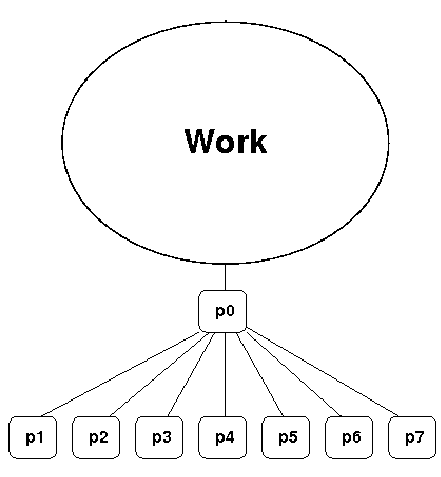

* One or more manager processes generate tasks and assign them to
  worker processes.

* Tasks may be allocated *a priori* if the manager can estimate the
  task size. 

* Alternatively, workers can be assigned small pieces when they are
  ready for more work.

* Care must be taken to ensure that the manager does not become a
  bottleneck. 

* Should choose granularity of tasks so that the cost of doing work
  dominates the cost of assigning/transferring work.

Manager-worker example: simulated annealing
""""""""""""""""""""""""""""""""""""""""""""""""""""""""""""""""""

*Simulated annealing* is a stochastic optimization algorithm for
functions with multiple local minima.

* At each iteration, a current solution is randomly changed to create
  an alternate solution in the neighborhood of the current solution. 

* The new iterate replaces the current solution if its function value
  is lower. 

* If the value is higher it can also replace the objective function
  with probability :math:`e^{-\Delta/T}`, where :math:`\Delta` is the
  difference in function values and :math:`T` is the ‘temperature’.

A manager process can set up a work queue with many initial iterates. 

* The manager assigns workers to each investigate different
  neighborhoods. 

* The manager keeps track of the *n* best solutions, adding new,
  refined neighborhoods to the queue to improve these ‘optimal’
  solutions.

* The manager decides when work stops by either setting a pre-defined
  iteration limit, or by noticing stagnation of the optimal solution
  set. 

.. index:: parallel decomposition; pipeline

Pipeline model
^^^^^^^^^^^^^^^^^^^^^^^^^^^^^^^^^^^^^^^^^^^^^^^^^^^^^^

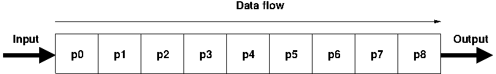

* A stream of data is passed through a succession of processes, each
  of which performs some task on the data.

* The pipeline typically involves a static mapping of tasks onto
  processes. 

* Forms a chain of producers and consumers, with each process
  consuming the output of preceding processes, and producing data for
  subsequent processes. 

* Load balancing is a function of task granularity:
 
  * The larger the granularity the longer it takes to fill the
    pipeline.

  * Too fine a granularity can increase overheads in the transmission
    of data. 

Pipeline example: repeated LU solves
""""""""""""""""""""""""""""""""""""""""""""""""""""""""""""""""""

Suppose we have the matrix decomposition :math:`A=LU`, where :math:`L`
and :math:`U` are lower and upper triangular matrices, respectively,
and we wish to solve :math:`Ax=b` for many different right-hand side
vectors :math:`b`.  

* Solution of :math:`Ax=b` may be performed through the two solves
  :math:`Ly=b` and then :math:`Ux=y`. 

* :math:`Ly=b` involves forward substitution:

  * :math:`y_1` is computed.

  * :math:`y_j, j=2,\ldots,n` are computed by updating :math:`b` with
    the preceding :math:`y`.  

* Then, :math:`Ux=y` involves backward substitution:

  * :math:`x_n` is computed

  * :math:`x_j, j=1,\ldots,n-1` are computed by updating :math:`y`
    with the previously-computed :math:`x` values.

* By distributing matrix rows onto processors, :math:`Ly=b` is a
  pipeline from top to bottom, and :math:`Ux=y` is a pipeline in the
  reverse direction. 

* Once one :math:`b` is finished we start the next.

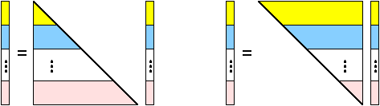

.. _parallel_computing_metrics:

Parallel computing metrics
------------------------------------

.. index:: parallel scalability

*Scalability* is the ability of a parallel algorithm to effectively
utilize a parallel machine.

.. index:: strong scaling

*Strong scaling*:  the goal is speed up algorithms that are possible
on one computer, but slow. 

* *Fix overall problem size* and increase the number of processors, *p*.

* Hope that the execution time decreases in inverse proportion to *p*.

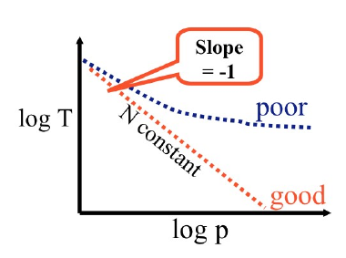

   [from David E. Keyes, HiPC 2007]

.. index:: weak scaling

*Weak scaling*: the goal is to enable problems that cannot fit on one
computer due to large size (resolution-limited). 

* *Fix problem size per processor*, and increase *p*.

* Hope that the execution time remains constant, as both problem size
  and process count are increased proportionately.

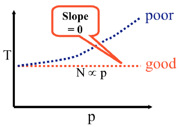

   [from David E. Keyes, HiPC 2007]

.. index:: parallel speedup, parallel efficiency

For strong-scaling tests, we also compute the following performance
measures: 

.. math::

   \mbox{Parallel speedup} &\ = \ \frac{\mbox{sequential execution time}}{\mbox{parallel execution time}} \\
   \mbox{Parallel efficiency} &\ = \ \frac{\mbox{Parallel speedup}}{\mbox{processors used}}
   \ = \ \frac{\mbox{sequential execution time}}{(\mbox{parallel execution time})(\mbox{processors used})}

.. index:: Amdahl's law

We typically compare these metrics against the theoretically
"best-case scenario", as determined through *Amdahl's Law* (1967):

* Let :math:`f` be the fraction of work that is not parallelizable;
  and :math:`(1-f)` be the fraction of work that is perfectly
  parallelizable.

* Assume it takes time :math:`t` to complete the task on one
  processor.

* The theoretical time for :math:`p` processors to accomplish the same
  task should be :math:`t \left(f + \frac{1-f}{p}\right)`.

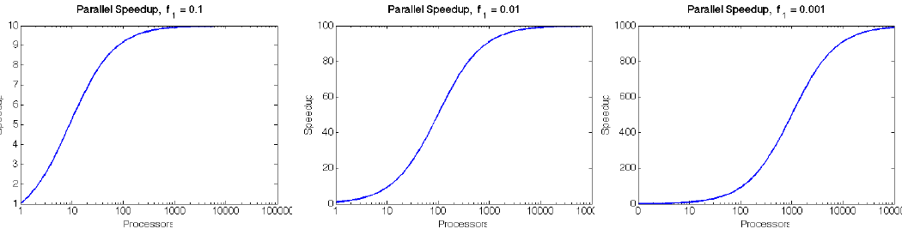

.. index:: 
   single: parallel computing resources
   single: resources; parallel computing

General parallel computing resources:

* Class: `Math 6370, Introduction to Parallel Scientific Computing
  <http://runge.math.smu.edu/Courses/Math6370_Spring13/>`_ 

* Book: `Designing and Building Parallel Programs, by Ian Foster
  <http://www.mcs.anl.gov/~itf/dbpp/>`_ 

* Online tutorial: `Introduction to Parallel Computing
  <https://computing.llnl.gov/tutorials/parallel_comp/>`_ 

Parallel computing libraries: MPI and OpenMP
=================================================================

.. index:: 
   pair: OpenMP; resources

OpenMP is the primary approach for enabling shared-memory parallel
computing.  It is implemented as an extension to compilers, and is
enabled by adding so-called *directives* or *pragmas* to your source
code, with suggestions on how to launch and share work among threads.

  OpenMP resources:

  * `OpenMP public site <http://openmp.org/wp/>`_

  * `OpenMP specifications reference manual
    <http://www.openmp.org/mp-documents/spec30.pdf>`_ 

  * `In-Depth Interactive OpenMP Tutorial
    <https://computing.llnl.gov/tutorials/openMP/>`_ 

.. index:: 
   pair: MPI; resources

MPI is the primary approach for enabling distributed-memory parallel
computing.  It is implemented as a library of functions and data
types, that may be called within your source code to send messages
among processes for coordination and data transfer.

  MPI resources:

  * `MPI public site <http://www.mpi-forum.org/>`_

  * `MPI specifications reference manual
    <http://www.mpi-forum.org/docs/mpi-3.0/mpi30-report.pdf>`_ 

  * `In-Depth Interactive MPI Tutorial
    <https://computing.llnl.gov/tutorials/mpi/>`_ 

  * `Advanced MPI Tutorial
    <https://computing.llnl.gov/tutorials/mpi_advanced/DavidCronkSlides.pdf>`_

Free parallel solver software
=================================================================

Since it is a library, MPI has enabled the development of many
powerful scientific computing solver libraries that build on top of
MPI to enable efficient, scalable and robust packages for parallel
scientific computing.

Dense linear solvers and eigenvalue solvers:

.. index:: ScaLAPACK

* `ScaLAPACK <http://netlib.org/scalapack>`_ -- dense and banded linear
  solvers and eigenvalue analysis [Fortran77] 

.. index:: PLAPACK

* `PLAPACK <http://www.cs.utexas.edu/~plapack>`_ -- dense matrix
  operations [C] 

Sparse/iterative linear/nonlinear solvers and eigenvalue solvers:

.. index:: SuperLU

* `SuperLU <http://crd.lbl.gov/~xiaoye/SuperLU>`_ -- direct solvers for
  sparse linear systems [C++, C, Fortran]

.. index:: HYPRE

* `HYPRE <http://www.llnl.gov/CASC/linear_solvers>`_ -- iterative
  solvers for sparse linear systems [C++, C, Fortran]

.. index:: PARPACK

* `PARPACK <http://www.caam.rice.edu/software/ARPACK>`_ -- large-scale
  eigenvalue problems [Fortran77] 

Other:

.. index:: SUNDIALS

* `SUNDIALS <http://www.llnl.gov/casc/sundials>`_ -- nonlinear, ODE,
  DAE solvers w/ sensitivities [C++, C, Fortran, Matlab] 

.. index:: FFTW

* `FFTW <http://www.fftw.org>`_ -- multi-dimensional parallel discrete
  Fourier transform [C++, C, Fortran] 

.. index:: ParMETIS

* `ParMETIS <http://www.cs.umn.edu/~metis>`_ -- graph partitioning
  meshing, sparse-matrix orderings [C]

.. index:: PHDF5

* `PHDF5 <http://www.hdfgroup.org>`_ -- parallel data input/output
  library [C++, C, Fortran] 

.. index:: mpiP

* `mpiP <http://mpip.sourceforge.net>`_ -- MPI profiling library [C++,
  C, Fortran] 

.. index:: LAMMPS

* `LAMMPS <http://lammps.sandia.gov>`_ -- large-scale molecular
  dynamics simulator [C++, C, Fortran, Python] 

Larger parallel packages (that include or can call many of the above
software):

.. index:: PETSc

* `PETSc <http://www.mcs.anl.gov/petsc>`_ -- data structures &
  nonlinear/linear PDE solvers [C++, C, Fortran, Python] 

.. index:: Trilinos

* `Trilinos <http://trilinos.sandia.gov>`_ -- enabling technologies
  for complex multi-physics problems [C++, Fortran, Python] 

.. raw:: html
   :file: counter.html

