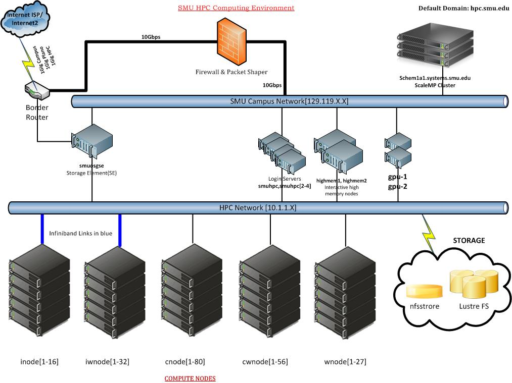

:tocdepth: 3

.. _session9:

*****************************************************
Session 9: Parallel Computing on SMU HPC
*****************************************************

*Instructor: Dan Reynolds*

*Assistant: Amit Kumar*

We will perform this session of the workshop using ``smuhpc2``,
``smuhpc3`` and ``smuhpc4`` login nodes, so open three windows, one on
each server.

SMU HPC network
=================================================================

   Schematic of the SMU HPC cluster

* Gigabit ethernet network connecting disks, login nodes and batch
  workers.

* Quadrics infiniband network for older parallel nodes.

* QLogic infiniband network for newer parallel nodes.

General information
=================================================================

.. index:: SMU HPC clusters

As seen in :ref:`session6`, the SMU HPC cluster is actually currently
comprised of four separate computing clusters: two batch processing
clusters for high-throughput computing, and two smaller parallel
computing clusters.  For future reference throughout the remainder of
this tutorial, we'll name these:

* *batch1* -- the 107 node, 8 core/node cluster,

* *batch2* -- the 56 node, 12 core/node cluster,

* *parallel1* -- the 16 node, 8 core/node cluster, and 

* *parallel2* -- the 32 node, 12 core/node cluster. 

Each of these components of the cluster is capable of running
parallel programs, albeit of different types and sizes.  As will be
elaborated on below, we differentiate between shared-memory parallel
(SMP) programs, typically enabled by OpenMP, and distributed-memory
parallel (DMP) programs, typically enabled by MPI.

Additionally, we have the choice between GNU and PGI compilers when
compiling our codes for these different execution environments.  In
the tutorial below, we differentiate between different
compiler/cluster/parallelism approaches, providing separate
instructions for each approach.  You need not use all of these
approaches, but they are provided for future reference.

Notes on job sizes
------------------------------------

.. index:: running large jobs

Large jobs
^^^^^^^^^^^^^^

  Although the condor job scheduler does not enforce maximum wall
  clock limits on user jobs, we *strongly* request that no single
  user monopolize the entire *parallel1* or *parallel2* cluster for an
  excessive amount of time (i.e. over 24 hours).  These are *shared
  resources*, not your own personal cluster.

.. index:: running small jobs

Small jobs
^^^^^^^^^^^^^^

  We *strongly* request that all jobs not using MPI and running on
  only one node (or less) of the cluster be run on the *batch1* or
  *batch2* portions of SMU HPC.  Since the *parallel1* and *parallel2*
  portions of the cluster are quite small, non-MPI jobs just "get
  in the way" of users who wish to actually use the infiniband
  network.

Getting started
------------------------------------

If you have not already set up your login script to initialize condor,
follow the instructions from tutorial :ref:`session 6
<session6_condor>` to do so.

Second, you will need to retrieve sets of files for both the OpenMP
and MPI portions of this session.  Retrieve the files for the OpenMP
portion by clicking :download:`this link <code/session9_OpenMP.tgz>`
or by copying them on SMUHPC at the command line:

.. code-block:: bash

   $ cp ~dreynolds/SMUHPC_tutorial/session9_OpenMP.tgz .

Similarly, retrieve the files for the MPI portion by clicking
:download:`this link <code/session9_MPI.tgz>` or by copying them
on SMUHPC at the command line:

.. code-block:: bash

   $ cp ~dreynolds/SMUHPC_tutorial/session9_MPI.tgz .

Shared-memory programs
=================================================================

Since SMP programs do not communicate between nodes via the network,
and hence cannot make use of the high-speed (and high-cost) infiniband
network on the *parallel1* and *parallel2* clusters, it is *strongly*
recommended that these be run on the *batch1* and *batch2* clusters:

* *batch1* -- capable of running SMP programs using up to 8 cores.

* *batch2* -- capable of running SMP programs using up to 12 cores.

The following links will take you directly to the subsections that
detail each compilation/execution approach for SMP computing:

* :ref:`Compiling with GNU <session9-compiling_OpenMP_GNU>`

* :ref:`Compiling with PGI <session9-compiling_OpenMP_PGI>`

* :ref:`Running at the command line <session9-running_OpenMP_commandline>`

* :ref:`Running on batch1 <session9-running_OpenMP_batch1>`

* :ref:`Running on batch2 <session9-running_OpenMP_batch2>`

..
   * :ref:`Running on parallel1 <session9-running_OpenMP_parallel1>`

   * :ref:`Running on parallel2 <session9-running_OpenMP_parallel2>`

Enabling OpenMP
------------------------------------

.. index:: OpenMP; compiler flags

OpenMP is implemented as an extension to existing programming
languages, and is available for programs written in C, C++, Fortran77
and Fortran90.  These OpenMP extensions are enabled at the compiler
level, with most compilers supporting OpenMP and others not.  In all
cases of which I am aware, OpenMP is enabled through supplying a flag
to the relevant compiler denoting that you wish for it to allow the
OpenMP extensions to the existing language.  The various compiler
flags for well-known compilers include:

* GNU: ``-fopenmp``

* PGI: ``-mp``

* Intel: ``-openmp``

* IBM: ``-qsmp``

* Oracle: ``-xopenmp``

* Absoft: ``-openmp``

* Cray: (on by default)

* NAG: ``-openmp``

Compiling with OpenMP
------------------------------------

Before proceeding to the following subsections, unpack the OpenMP
portion of this tutorial using the usual commands:

.. code-block:: bash

   $ tar -zxf session9_OpenMP.tgz

In the resulting directory, you will find a number of files, including
``Makefile``, ``driver.cpp`` and ``vectors.cpp``.  

.. index:: OpenMP example; compiling with GNU

.. _session9-compiling_OpenMP_GNU:

Compiling OpenMP code with the GNU compilers
^^^^^^^^^^^^^^^^^^^^^^^^^^^^^^^^^^^^^^^^^^^^^^^^^^^^^^

You can compile the executable ``driver.exe`` with the GNU compiler and
OpenMP using the command 

.. code-block:: bash

   $ g++ -fopenmp driver.cpp vectors.cpp -lm -o driver.exe

The compiler option ``-fopenmp`` is the same, no matter which GNU
compiler you are using (``gcc``, ``gfortran``, etc.)

.. index:: OpenMP example; compiling with PGI

.. _session9-compiling_OpenMP_PGI:

Compiling OpenMP code with the PGI compilers
^^^^^^^^^^^^^^^^^^^^^^^^^^^^^^^^^^^^^^^^^^^^^^^^^^^^^^

Assuming that you have already loaded the PGI module, you can compile
the executable ``driver.exe`` with the PGI compiler and OpenMP using
the command  

.. code-block:: bash

   $ pgc++ -mp driver.cpp vectors.cpp -lm -o driver.exe

The compiler option ``-mp`` is the same, no matter which PGI
compiler you are using (``pgcc``, ``pgfortran``, etc.)

Running with OpenMP 
------------------------------------

.. index:: OpenMP; running at the command line

.. _session9-running_OpenMP_commandline:

Running OpenMP programs at the command line
^^^^^^^^^^^^^^^^^^^^^^^^^^^^^^^^^^^^^^^^^^^^^^^^^^^^^^

Run the executable ``driver.exe`` from the command line:

.. code-block:: bash

   $ ./driver.exe

In fact, this executable did not run using more than one thread, since
the default behavior of OpenMP programs on SMU HPC is to only use a
single thread.

.. index:: OpenMP; OMP_NUM_THREADS

To change the number of threads used by our program, we must adjust
the ``OMP_NUM_THREADS`` environment variable. First, verify that this is
set to the default value of 1 (or it may be blank): 

.. code-block:: bash

   $ echo $OMP_NUM_THREADS

Recalling from session 2 of the workshop, the method for re-setting
this environment variable will depend on our login shell.  For CSH/TCSH
users, 

.. code-block:: tcsh

   $ setenv OMP_NUM_THREADS 2

will adjust this variable to 2; the same may be accomplished in
BASH/SH/KSH users with the command 

.. code-block:: bash

   $ export OMP_NUM_THREADS=2

Re-run ``driver.exe`` first using 1 and then using 2 OpenMP
threads.  Notice the speedup when running with multiple threads. 

.. index:: OpenMP example; running on batch1

.. _session9-running_OpenMP_batch1:

Running OpenMP jobs on *batch1*
^^^^^^^^^^^^^^^^^^^^^^^^^^^^^^^^^^^^^^^^^^^^^^^^^^^^^^

To run OpenMP-enabled code on the *batch1* cluster, the steps are identical
to those required for requesting an entire compute node, except that
now we must additionally specify the environment variable
``OMP_NUM_THREADS``.  It is recommended that this variable be supplied
as one of the entries in the **environment** option to condor.  

Additionally, we should request that we wish to run on a "wnode" or
"cnode", since those comprise the *batch1* portion of the SMU HPC cluster.

For example, if we set our condor job submission file to either

.. code-block:: text

   universe              = vanilla
   getenv                = true
   log                   = OMPtest.log
   error                 = OMPtest.err
   output                = OMPtest.out
   executable            = driver.exe
   environment           = OMP_NUM_THREADS=7
   Requirements          = regexp("wnode", Machine)
   Requirements          = CAN_RUN_WHOLE_MACHINE
   +RequiresWholeMachine = True
   queue

or to
  
.. code-block:: text

   universe              = vanilla
   getenv                = true
   log                   = OMPtest.log
   error                 = OMPtest.err
   output                = OMPtest.out
   executable            = driver.exe
   environment           = OMP_NUM_THREADS=7
   Requirements          = regexp("cnode", Machine)
   Requirements          = CAN_RUN_WHOLE_MACHINE
   +RequiresWholeMachine = True
   queue
  
it will signify to condor that we wish to launch ``driver.exe`` on a
single dedicated node, and that once the job is launched, we will use
7 of the hardware threads on that node (recall, *batch1* has 8 cores per
node, so this would entail one core remaining idle).

This job file should be launched from either ``smuhpc.smu.edu`` or
``smuhpc2.smu.edu``. 

.. index:: OpenMP example; running on batch2

.. _session9-running_OpenMP_batch2:

Running OpenMP jobs on *batch2*
^^^^^^^^^^^^^^^^^^^^^^^^^^^^^^^^^^^^^^^^^^^^^^^^^^^^^^

To run OpenMP-enabled code on the *batch2* cluster, the steps are identical
to those required for requesting an entire compute node, except that
now we must additionally specify the environment variable
``OMP_NUM_THREADS``.  It is recommended that this variable be supplied
as one of the entries in the **environment** option to condor.  

Additionally, we should request that we wish to run on a "cwnode",
since those comprise the *batch2* portion of the SMU HPC cluster. 

For example, if we set our condor job submission file to

.. code-block:: text

   universe              = vanilla
   getenv                = true
   log                   = OMPtest.log
   error                 = OMPtest.err
   output                = OMPtest.out
   executable            = driver.exe
   environment           = OMP_NUM_THREADS=11
   Requirements          = regexp("cwnode", Machine)
   Requirements          = CAN_RUN_WHOLE_MACHINE
   +RequiresWholeMachine = True
   queue

it will signify to condor that we wish to launch ``driver.exe`` on a
single dedicated node, and that once the job is launched, we will use
11 of the hardware threads on that node (recall, *batch2* has 12 cores per
node, so this would entail one core remaining idle).

This job file should be launched from either ``smuhpc.smu.edu`` or
``smuhpc2.smu.edu``. 

..
   .. index:: OpenMP example; running on parallel1

   .. _session9-running_OpenMP_parallel1:

   Running OpenMP jobs on *parallel1*
   ^^^^^^^^^^^^^^^^^^^^^^^^^^^^^^^^^^^^^^^^^^^^^^^^^^^^^^

   To run OpenMP-enabled code on the *parallel1* cluster, the steps are
   identical to those required for requesting an entire compute node,
   except for the following changes:

   * We must additionally specify the environment variable
     ``OMP_NUM_THREADS``.  It is recommended that this variable be
     supplied as one of the entries in the **environment** 
     option to condor.

   * The job *must be launched from* ``smuhpc4.smu.edu``, since that
     manages the parallel clusters.

   * We should specify that we only want one node via setting the
     **machine_count** option to 1.

   * The **universe** must be set to ``parallel``, indicating that it
     should be run on one of the parallel clusters.

   * We should specify that we wish to run on a "inode", since those
     comprise the *parallel1* cluster.

   For example, if we set our condor job submission file to

   .. code-block:: text

      universe              = parallel
      getenv                = true
      log                   = OMPtest.log
      error                 = OMPtest.err
      output                = OMPtest.out
      executable            = driver.exe
      environment           = OMP_NUM_THREADS=5
      machine_count         = 1
      Requirements          = regexp("inode", Machine)
      queue

   it will signify to condor that we wish to launch ``driver.exe`` on a
   single dedicated node, and that once the job is launched, we will use
   5 of the hardware threads on that node (recall, *parallel1* has 8 cores per
   node, so this would entail 3 cores remaining idle).

   Because this job will run within the "parallel" universe on either the
   *parallel1* or *parallel2* clusters, this job file must be launched from
   ``smuhpc4.smu.edu``.

   .. index:: OpenMP example; running on parallel2

   .. _session9-running_OpenMP_parallel2:

   Running OpenMP jobs on *parallel2*
   ^^^^^^^^^^^^^^^^^^^^^^^^^^^^^^^^^^^^^^^^^^^^^^^^^^^^^^

   To run OpenMP-enabled code on the *parallel2* cluster, the steps are
   identical to those required for requesting an entire compute node,
   except for the following changes:

   * We must additionally specify the environment variable
     ``OMP_NUM_THREADS``.  It is recommended that this variable be
     supplied as one of the entries in the **environment** 
     option to condor.

   * The job *must be launched from* ``smuhpc4.smu.edu``, since that
     manages the parallel clusters.

   * We should specify that we only want one node via setting the
     **machine_count** option to 1.

   * The **universe** must be set to ``parallel``, indicating that it
     should be run on one of the parallel clusters.

   * We should specify that we wish to run on a "iwnode", since those
     comprise the *parallel2* cluster.

   For example, if we set our condor job submission file to

   .. code-block:: text

      universe              = parallel
      getenv                = true
      log                   = OMPtest.log
      error                 = OMPtest.err
      output                = OMPtest.out
      executable            = driver.exe
      environment           = OMP_NUM_THREADS=10
      machine_count         = 1
      Requirements          = regexp("iwnode", Machine)
      queue

   it will signify to condor that we wish to launch ``driver.exe`` on a
   single dedicated node, and that once the job is launched, we will use
   10 of the hardware threads on that node (recall, *parallel2* has 12 cores per
   node, so this would entail 2 cores remaining idle).

   Because this job will run within the "parallel" universe on either the
   *parallel1* or *parallel2* clusters, this job file must be launched from
   ``smuhpc4.smu.edu``.

OpenMP exercise
------------------------------------

Compile the program ``driver.exe`` using the PGI compiler with OpenMP
enabled.

Create a single condor submission script that will run the program
``driver.exe`` using 1, 2, 3, ..., 12 OpenMP threads on the *batch2*
portion of the cluster.  Recall from session 6
(:ref:`running_multiple_condor_jobs`), that a single script may launch
multiple jobs by including multiple **queue** statements.

Launch these jobs, and when they have completed, determine the *strong
scaling performance* of this code (defined in session 8,
:ref:`parallel_computing_metrics`).  How well does the program
perform?  Is there a maximum number of threads where, beyond which,
additional resources no longer improve the speed?

Distributed-memory programs
=================================================================

Since DMP programs require communication between nodes via the
network, and it is unlikely that users will wish to run such programs
using only a single node at a time, SMU HPC is configured to only
allow multi-node DMP programs using the *parallel1* and *parallel2*
clusters: 

* *parallel1* -- capable of running DMP programs using up to 128 cores.

* *parallel2* -- capable of running DMP programs using up to 384 cores.

Alternatively, you may run a single-node DMP program interactively
(e.g. for debugging purposes, parallel data analysis, parallel
visualization) on the ``smuhpc3``, ``highmem1``, ``highmem2``,
``gpu1`` or ``gpu2`` nodes.

The following links will take you directly to the subsections that
detail each compilation/execution approach for DMP computing:

* :ref:`MPI compiler wrappers <session9-compiling_MPI_programs>`

* :ref:`Compiling/running MPI interactively <session9-running_MPI_command_line>`

..
   * The batch1 and batch2 clusters:

     * :ref:`Compiling with GNU <session9-compiling_MPI_GNU_batch>`

     * :ref:`Running with GNU <session9-running_MPI_GNU_batch>`

     * :ref:`Compiling with PGI <session9-compiling_MPI_PGI_batch>`

     * :ref:`Running with PGI <session9-running_MPI_PGI_batch>`
 
* The *parallel1* cluster:

  * :ref:`Compiling with GNU <session9-compiling_MPI_GNU_parallel1>`

  * :ref:`Running with GNU <session9-running_MPI_GNU_parallel1>`

  * :ref:`Compiling with PGI <session9-compiling_MPI_PGI_parallel1>`

  * :ref:`Running with PGI <session9-running_MPI_PGI_parallel1>`

* The *parallel2* cluster:

  * :ref:`Compiling with GNU <session9-compiling_MPI_GNU_parallel2>`

  * :ref:`Running with GNU <session9-running_MPI_GNU_parallel2>`

  * :ref:`Compiling with PGI <session9-compiling_MPI_PGI_parallel2>`

  * :ref:`Running with PGI <session9-running_MPI_PGI_parallel2>`

MPI overview
------------------------------------

Unpack the source files for the MPI portion of this tutorial as usual,

.. code-block:: bash

   $ tar -zxf session9_MPI.tgz

Unlike OpenMP, MPI is implemented as a standalone library that may be
called by programs wishing to perform message passing to perform a
distributed memory parallel computation.  Typically written in C (for
maximum portability), MPI libraries typically include interfaces for
programs written in C, C++, Fortran77, Fortran90 and Python.

Moreover, since MPI is a library, it does not require any specific
compiler extensions to construct a MPI-enabled parallel program,
although it is typical for highly optimized versions of the MPI
library that you use the same compiler for your program that was used
to construct the library.

Compiling MPI code
------------------------------------

.. index:: MPI wrapper scripts

.. _session9-compiling_MPI_programs:

MPI wrapper scripts
^^^^^^^^^^^^^^^^^^^^^^^^^^^^^^^^^^^^^^^^^^^^^^^^^^^^^^

Typically, in order to compile a program to use a library, a few key
items must be known about how the library was installed on the
system:

* Does the library provide header files (C, C++) or modules (F90),
  and where are these located?  This location is important
  because when compiling our own codes, we must typically tell the
  compiler where to look for these "include files" using the ``-I``
  argument.

* If the library was installed in a non-default location, where is
  the resulting ".a" file (static library) or ".so" file (shared
  library) located?  Again, this location is important
  because when linking our own codes, we must typically tell the
  compiler where to look for these library files using the ``-L``
  and ``-l`` arguments.

For example, the PGI-compiled MPI library, MPICH2 version 1.3.2, is
installed on SMU HPC in the directory ``/grid/software/mpich2-1.3.2``,
with header files located in ``/grid/software/mpich2-1.3.2/include``
and library files located in  ``/grid/software/mpich2-1.3.2/lib``.
Finally, because I'm familiar with this package, I know that to
compile an executable I must link against the files ``libmpich.a`` and
``libmpl.a`` in this library directory location.  

As a result, we could compile the executable ``driver.exe`` with the
commands 

  .. code-block:: bash

     $ pgc++ driver.cpp -I/grid/software/mpich2-1.3.2/include \
       -L/grid/software/mpich2-1.3.2/lib -lmpich -lmpl -lm -o driver.exe

Clearly, specifying the specific instructions for including and
linking to an MPI library can be nontrivial: 

* You must know where all of the relevant libraries are installed on
  each computer. 

* You must know which specific library files are required for
  compiling a given program. 

* Sometimes, you must even know which order you need to specify these
  specific library files in the linking line. 

Thankfully, MPI library writers typically include MPI *wrapper scripts*
to do most of this work for you. Such scripts are written to encode
all of the above information that is required to use MPI with a given
compiler on a specific system. 

.. index:: 
   single: MPI wrapper scripts; mpicxx
   single: MPI wrapper scripts; mpiCC
   single: MPI wrapper scripts; mpic++
   single: MPI wrapper scripts; openmpicxx
   single: MPI wrapper scripts; mpicc
   single: MPI wrapper scripts; openmpicc
   single: MPI wrapper scripts; mpif90
   single: MPI wrapper scripts; openmpif90
   single: MPI wrapper scripts; mpif77
   single: MPI wrapper scripts; openmpif77

Depending on your programming language and the specific MPI
implementation, these wrapper scripts can have different names. The
typical names for these MPI wrapper scripts are below: 

* C++: ``mpicxx``, ``mpiCC``, ``mpic++`` or ``openmpicxx``

* C: ``mpicc`` or ``openmpicc``

* Fortran 90/95: ``mpif90`` or ``openmpif90``

* Fortran 77: ``mpif77`` or ``openmpif77`` (typically, the Fortran
  90/95 wrapper will also work for these)

In order to use these wrapper scripts on SMU HPC, we must first load
the correct module environment.  We'll discuss each of these in the
appropriate context within the following subsections, that focus on
the myriad compilers and clusters we wish to use.

.. index:: MPI example; compiling with GNU for parallel1

.. _session9-compiling_MPI_GNU_parallel1:

Compiling MPI code with the GNU compilers for *parallel1*
^^^^^^^^^^^^^^^^^^^^^^^^^^^^^^^^^^^^^^^^^^^^^^^^^^^^^^^^^^^^^

Compilation must occur on ``smuhpc4.smu.edu``.

First, load the ``mvapich2/1.6/gcc`` module,

.. code-block:: bash

   $ module load mvapich2/1.6/gcc

Second, compile your executable using one of the MPI wrapper scripts:
``mpicc``, ``mpicxx``, ``mpif90`` or ``mpif77``.  For example, we may
compile the example executable as

.. code-block:: bash

   $ mpicxx driver.cpp -lm -o driver_GNU_parallel1.exe

Note: since the MPI libraries vary based on where we wish to run and
on which compilers we use, I recommend naming the executable
appropriately to distinguish it from other compilation approaches.  Of
course, this is not required.

.. index:: MPI example; compiling with PGI for parallel1

.. _session9-compiling_MPI_PGI_parallel1:

Compiling MPI code with the PGI compilers for *parallel1*
^^^^^^^^^^^^^^^^^^^^^^^^^^^^^^^^^^^^^^^^^^^^^^^^^^^^^^^^^^^^

Compilation must occur on ``smuhpc4.smu.edu``.

First, load the ``mvapich2/1.6/pgi`` module,

.. code-block:: bash

   $ module load mvapich2/1.6/pgi pgi/13.2/64bit

Second, compile your executable using one of the MPI wrapper scripts:
``mpicc``, ``mpicxx``, ``mpif90`` or ``mpif77``.  For example, we may
compile the example executable as

.. code-block:: bash

   $ mpicxx driver.cpp -lm -o driver_PGI_parallel1.exe

Note: since the MPI libraries vary based on where we wish to run and
on which compilers we use, I recommend naming the executable
appropriately to distinguish it from other compilation approaches.  Of
course, this is not required.

.. index:: MPI example; compiling with GNU for parallel2

.. _session9-compiling_MPI_GNU_parallel2:

Compiling MPI code with the GNU compilers for *parallel2*
^^^^^^^^^^^^^^^^^^^^^^^^^^^^^^^^^^^^^^^^^^^^^^^^^^^^^^^^^^^^

Compilation must occur on ``smuhpc.smu.edu``, ``smuhpc2.smu.edu`` or
``smuhpc3.smu.edu``, but **not** on ``smuhpc4``.

First, load the ``mvapich2/1.6/gcc-QL`` module,

.. code-block:: bash

   $ module load mvapich2/1.6/gcc-QL

Second, compile your executable using one of the MPI wrapper scripts:
``mpicc``, ``mpicxx``, ``mpif90`` or ``mpif77``.  For example, we may
compile the example executable as

.. code-block:: bash

   $ mpicxx driver.cpp -lm -o driver_GNU_parallel2.exe

Note: since the MPI libraries vary based on where we wish to run and
on which compilers we use, I recommend naming the executable
appropriately to distinguish it from other compilation approaches.  Of
course, this is not required.

.. index:: MPI example; compiling with PGI for parallel2

.. _session9-compiling_MPI_PGI_parallel2:

Compiling MPI code with the PGI compilers for *parallel2*
^^^^^^^^^^^^^^^^^^^^^^^^^^^^^^^^^^^^^^^^^^^^^^^^^^^^^^^^^^^^

Compilation must occur on ``smuhpc.smu.edu``, ``smuhpc2.smu.edu`` or
``smuhpc3.smu.edu``, but **not** on ``smuhpc4``.

First, load the ``mvapich2/1.6/pgi-QL`` module,

.. code-block:: bash

   $ module load mvapich2/1.6/pgi-QL

Second, compile your executable using one of the MPI wrapper scripts:
``mpicc``, ``mpicxx``, ``mpif90`` or ``mpif77``.  For example, we may
compile the example executable as

.. code-block:: bash

   $ mpicxx driver.cpp -lm -o driver_PGI_parallel2.exe

Note: since the MPI libraries vary based on where we wish to run and
on which compilers we use, I recommend naming the executable
appropriately to distinguish it from other compilation approaches.  Of
course, this is not required.

..
   .. index:: MPI example; compiling with GNU for batch1 and batch2

   .. _session9-compiling_MPI_GNU_batch:

   Compiling MPI code with the GNU compilers for *batch1* and *batch2*
   ^^^^^^^^^^^^^^^^^^^^^^^^^^^^^^^^^^^^^^^^^^^^^^^^^^^^^^^^^^^^^^^^^^^^^^^

   Compilation can occur on any SMU HPC login node.

   First, load the ``mpich2/1.1.1/gcc`` module,

   .. code-block:: bash

      $ module load mpich2/1.1.1/gcc

   Second, compile your executable using one of the MPI wrapper scripts:
   ``mpicc``, ``mpicxx``, ``mpif90`` or ``mpif77``.  For example, we may
   compile the example executable as

   .. code-block:: bash

      $ mpicxx driver.cpp -lm -o driver_GNU_batch.exe

   Note: since the MPI libraries vary based on where we wish to run and
   on which compilers we use, I recommend naming the executable
   appropriately to distinguish it from other compilation approaches.  Of
   course, this is not required.

   .. index:: MPI example; compiling with PGI for batch1 and batch2

   .. _session9-compiling_MPI_PGI_batch:

   Compiling MPI code with the PGI compilers for *batch1* and *batch2*
   ^^^^^^^^^^^^^^^^^^^^^^^^^^^^^^^^^^^^^^^^^^^^^^^^^^^^^^^^^^^^^^^^^^^^^^

   Compilation can occur on any SMU HPC login node.

   First, load the ``mpich2/1.3.2/pgi`` module,

   .. code-block:: bash

      $ module load mpich2/1.3.2/pgi

   Second, compile your executable using one of the MPI wrapper scripts:
   ``mpicc``, ``mpicxx``, ``mpif90`` or ``mpif77``.  For example, we may
   compile the example executable as

   .. code-block:: bash

      $ mpicxx driver.cpp -lm -o driver_PGI_batch.exe

   Note: since the MPI libraries vary based on where we wish to run and
   on which compilers we use, I recommend naming the executable
   appropriately to distinguish it from other compilation approaches.  Of
   course, this is not required.

Running MPI code
------------------------------------

.. index:: MPI example; running interactively

.. _session9-running_MPI_command_line:

Running MPI code interactively
^^^^^^^^^^^^^^^^^^^^^^^^^^^^^^^^^^^^^^^^^^^^^^^^^^^^^^

When running jobs on a dedicated parallel cluster (or a single workstation),
parallel jobs and processes are not regulated through a queueing
system. This has some immediate benefits: 

* You never have to wait to run a program.

* It is easy to set up and run parallel jobs.

* You have complete control over which processors are used in a parallel computation.

However, dedicated clusters also have some serious deficiencies:

* A single user can hog all of the resources.

* More than one job can be running on a processor at a time, so
  different processes must fight for system resources (giving
  unreliable timings or memory availability). 

* The more users there are, the worse these problems become.

However, running parallel programs on such a system can be very
simple, though the way that you run these jobs will depend on which
MPI implementation you are using. 

On SMU HPC, we should only run interactive programs on ``smuhpc3``,
``highmem1``, ``highmem2``, ``gpu1`` or ``gpu2``.  Log on to
``smuhpc3``, and go to the directory where you've downloaded the
``session9_MPI`` codes.

To run locally on this node, we need to use the ``mpich2/1.1.1/gcc`` module,

.. code-block:: bash

   $ module load mpich2/1.1.1/gcc

We then must compile using one of the MPI wrapper scripts:
``mpicc``, ``mpicxx``, ``mpif90`` or ``mpif77``; here we use

.. code-block:: bash

   $ mpicxx driver.cpp -lm -o driver_GNU_interactive.exe

Since ``smuhpc3`` has 8 physical CPU cores, we are limited to using at
most 8 MPI processes.  The command-line program that launches our
interactive job is ``mpiexec``, to which we supply both the number of
desired MPI processes and the executable we just compiled.  The
calling syntax of ``mpiexec`` is 

.. code-block:: text

   mpiexec [mpiexec_options] program_name [program_options]

The primary ``mpiexec`` option that we use is ``-n #``, where ``#`` is
the desired number of MPI processes to use in running the parallel job.

However, before we can use ``mpiexec`` we must first enable it to
launch processes on this node, using the ``mpd`` program:

.. code-block:: bash

   $ mpd &

Once this returns to the prompt, we may launch our jobs.  Run the
program using 1 process: 

.. code-block:: bash

   $ mpiexec -n 1 ./driver_GNU_interactive.exe

Run the program using 2 processes:

.. code-block:: bash

   $ mpiexec -n 2 ./driver_GNU_interactive.exe

Run the program using 4 processes:

.. code-block:: bash

   $ mpiexec -n 4 ./driver_GNU_interactive.exe

All of these will run the MPI processes as separate threads on
``smuhpc3``.

Once finished, you should kill your ``mpd`` job since it is no longer
in use:

.. code-block:: bash

   $ jobs
   [1]+  Running                 mpd &
   $ kill %1
   [1]+  Terminated              mpd

Although ``smuhpc3`` has 8 physical cores, because it is a shared
login node among all SMU HPC users, you should **not** run any MPI
jobs on it using more than 6 processes.  Similarly, for long-running
jobs (e.g. over 30 minutes), you should limit yourself to using at
most 4 processes. 

.. index:: MPI example; running with GNU on parallel1

.. _session9-running_MPI_GNU_parallel1:

Running MPI code with the GNU compilers on *parallel1*
^^^^^^^^^^^^^^^^^^^^^^^^^^^^^^^^^^^^^^^^^^^^^^^^^^^^^^^^^

You must launch the job from ``smuhpc4.smu.edu``.

The key to launching MPI jobs that utilize more than one node using
either *parallel1* or *parallel2* is that you must supply an "executable"
to condor that handles the process of launching your program
appropriately.  This Condor/MPI interaction is taken care of by 
incorporating a few specific items into your condor submission script,
along with a customized executable script that handles the launching
of your executable.

.. index:: mvapich_script

This executable script is named ``mvapich_script``, and is included
in the ``session9_MPI`` directory that you downloaded above.  You
should not need to edit this script file except for more advanced
usage scenarios, which we will not cover during this tutorial.

.. index:: mvapich_condor.sub

However, the example condor submission file, ``mvapich_condor.sub`` does
contain specific items that you will need to modify for your usage
scenario.  This file, modified for the GNU/*parallel1* usage scenario,
is reproduced here: 

.. code-block:: bash

   # FILENAME mvapich_condor.sub
   # Use this script to submit MPI jobs on parallel1 and parallel2.
   # Read the instructions carefully and 
   # report any issues to your system admins. 

   ###############################################
   # Edit the following lines to set up your run #
   ###############################################

   # Your actual executable file name along with arguments goes here
   arguments     = "driver_GNU_parallel1.exe"

   # Total number of nodes you would like to run your code on
   machine_count = 2

   # The particular node type you wish to use,
   # valid values are {inode,iwnode}
   mynodetype    = "inode"

   # Here you define the specific environment variables
   # _LOAD_MODULE  MPI module required for your job
   # _WAY          Number of MPI processes to run on each node
   environment   = "_LOAD_MODULE=mvapich2/1.6/gcc _WAY=3"

   # Select the appropriate file name for your output files.
   output = out.txt
   error  = err.txt
   log    = log.txt

   # Set email notification settings here
   notification = Always
   notify_user  = username@smu.edu

   ###################################
   # Do not edit the following lines #
   ###################################
   universe     = parallel
   executable   = mvapich_script
   getenv       = true
   requirements = regexp($(mynodetype), Machine)
   +WantParallelSchedulingGroups = TRUE
   queue

As should be clear from the structure of this file, you only need to
modify the first few blocks of options:

* ``arguments`` -- this should include *both* your executable file
  name and any command-line arguments that it requires.  If more than
  one item is listed (i.e. if your program uses any command-line
  arguments), they should be enclosed in double-quotation marks.

* ``machine_count`` -- this should be the number of nodes that you
  wish to use for your program.  Recall that each node on *parallel1*
  has 8 cores.

* ``mynodetype`` -- this is the type of node you wish to use, here it
  uses "inode", which is the name of the nodes comprisong *parallel1*.

* ``environment`` -- in addition to any environment variables you wish
  to specify on your own, you must specify the following two:
 
  * ``_LOAD_MODULE`` -- this is the MPI module required to compile
    your job.  For GNU on *parallel1*, the module is
    ``mvapich2/1.6/gcc``, as entered here.

  * ``_WAY`` -- this is the number of cores on each of your requested
    nodes that you wish to use (1 :math:`\le`  ``_WAY`` :math:`\le`
    8).  For example, if you chose 8 nodes and 3 way, you would run
    with 24 total MPI processes.

* ``output``, ``error`` and ``log`` are as usual.

You should not modify any arguments below the lines

.. code-block:: bash

   ###################################
   # Do not edit the following lines #
   ###################################

To use this script you must also have the ``mvapich_script`` file in
the same directory as your executable file and your condor job
submission file.  I suggest that you copy this to somewhere safe in
your home directory so that you can re-use it later on.

Once you have finished setting up these files, you can submit the job as
usual (only from the  ``smuhpc4`` login node),

.. code-block:: bash

   $ condor_submit ./mvapich_condor.sub

.. index:: MPI example; running with PGI on parallel1

.. _session9-running_MPI_PGI_parallel1:

Running MPI code with the PGI compilers on *parallel1*
^^^^^^^^^^^^^^^^^^^^^^^^^^^^^^^^^^^^^^^^^^^^^^^^^^^^^^^^^

You must launch the job from ``smuhpc4.smu.edu``.

The key to launching MPI jobs that utilize more than one node using
either *parallel1* or *parallel2* is that you must supply an "executable"
to condor that handles the process of launching your program
appropriately.  This Condor/MPI interaction is taken care of by
incorporating a few specific items into your condor submission script,
along with a customized executable script that handles the launching
of your executable.

.. index:: mvapich_script

This executable script is named ``mvapich_script``, and is included
in the ``session9_MPI`` directory that you downloaded above.  You
should not need to edit this script file except for more advanced
usage scenarios, which we will not cover during this tutorial.

.. index:: mvapich_condor.sub

However, the example condor submission file, ``mvapich_condor.sub`` does
contain specific items that you will need to modify for your usage
scenario.  This file, modified for the PGI/*parallel1* usage scenario,
is reproduced here: 

.. code-block:: bash

   # FILENAME mvapich_condor.sub
   # Use this script to submit MPI jobs on parallel1 and parallel2.
   # Read the instructions carefully and 
   # report any issues to your system admins. 

   ###############################################
   # Edit the following lines to set up your run #
   ###############################################

   # Your actual executable file name along with arguments goes here
   arguments     = "driver_PGI_parallel1.exe"

   # Total number of nodes you would like to run your code on
   machine_count = 3

   # The particular node type you wish to use,
   # valid values are {inode,iwnode}
   mynodetype    = "inode"

   # Here you define the specific environment variables
   # _LOAD_MODULE  MPI module required for your job
   # _WAY          Number of MPI processes to run on each node
   environment   = "_LOAD_MODULE=mvapich2/1.6/pgi _WAY=4"

   # Select the appropriate file name for your output files.
   output = out.txt
   error  = err.txt
   log    = log.txt

   # Set email notification settings here
   notification = Always
   notify_user  = username@smu.edu

   ###################################
   # Do not edit the following lines #
   ###################################
   universe     = parallel
   executable   = mvapich_script
   getenv       = true
   requirements = regexp($(mynodetype), Machine)
   +WantParallelSchedulingGroups = TRUE
   queue

As should be clear from the structure of this file, you only need to
modify the first few blocks of options:

* ``arguments`` -- this should include *both* your executable file
  name and any command-line arguments that it requires.  If more than
  one item is listed (i.e. if your program uses any command-line
  arguments), they should be enclosed in double-quotation marks.

* ``machine_count`` -- this should be the number of nodes that you
  wish to use for your program.  Recall that each node on *parallel1*
  has 8 cores.

* ``mynodetype`` -- this is the type of node you wish to use, here it
  uses "inode", which is the name of the nodes comprisong *parallel1*.

* ``environment`` -- in addition to any environment variables you wish
  to specify on your own, you must specify the following two:
 
  * ``_LOAD_MODULE`` -- this is the MPI module required to compile
    your job.  For GNU on *parallel1*, the module is
    ``mvapich2/1.6/pgi``, as entered here.

  * ``_WAY`` -- this is the number of cores on each of your requested
    nodes that you wish to use (1 :math:`\le`  ``_WAY`` :math:`\le`
    8).  For example, if you chose 3 nodes and 4 way, you would run
    with 12 total MPI processes.

* ``output``, ``error`` and ``log`` are as usual.

You should not modify any arguments below the lines

.. code-block:: bash

   ###################################
   # Do not edit the following lines #
   ###################################

To use this script you must also have the ``mvapich_script`` file in
the same directory as your executable file and your condor job
submission file.  I suggest that you copy this to somewhere safe in
your home directory so that you can re-use it later on.

Once you have finished setting up these files, you can submit the job as
usual (only from the  ``smuhpc4`` login node),

.. code-block:: bash

   $ condor_submit ./mvapich_condor.sub

.. index:: MPI example; running with GNU on parallel2

.. _session9-running_MPI_GNU_parallel2:

Running MPI code with the GNU compilers on *parallel2*
^^^^^^^^^^^^^^^^^^^^^^^^^^^^^^^^^^^^^^^^^^^^^^^^^^^^^^^^^^

You must launch the job from ``smuhpc4.smu.edu`` (even though you
could not compile it on that node -- sorry).

The key to launching MPI jobs that utilize more than one node using
either *parallel1* or *parallel2* is that you must supply an "executable"
to condor that handles the process of launching your program
appropriately.  This Condor/MPI interaction is taken care of by
incorporating a few specific items into your condor submission script,
along with a customized executable script that handles the launching
of your executable.

.. index:: mvapich_script

This executable script is named ``mvapich_script``, and is included
in the ``session9_MPI`` directory that you downloaded above.  You
should not need to edit this script file except for more advanced
usage scenarios, which we will not cover during this tutorial.

.. index:: mvapich_condor.sub

However, the example condor submission file, ``mvapich_condor.sub`` does
contain specific items that you will need to modify for your usage
scenario.  This file, modified for the GNU/*parallel2* usage scenario,
is reproduced here: 

.. code-block:: bash

   # FILENAME mvapich_condor.sub
   # Use this script to submit MPI jobs on parallel1 and parallel2.
   # Read the instructions carefully and 
   # report any issues to your system admins. 
   
   ###############################################
   # Edit the following lines to set up your run #
   ###############################################
   
   # Your actual executable file name along with arguments goes here
   arguments     = "driver_GNU_parallel2.exe"
   
   # Total number of nodes you would like to run your code on
   machine_count = 2
   
   # The particular node type you wish to use,
   # valid values are {inode,iwnode}
   mynodetype    = "iwnode"
   
   # Here you define the specific environment variables
   # _LOAD_MODULE  MPI module required for your job
   # _WAY          Number of MPI processes to run on each node
   environment = "_LOAD_MODULE=mvapich2/1.6/gcc-QL _WAY=11"
   
   # Select the appropriate file name for your output files.
   output = out.txt
   error  = err.txt
   log    = log.txt
   
   # Set email notification settings here
   notification = Always
   notify_user  = username@smu.edu
   
   
   ###################################
   # Do not edit the following lines #
   ###################################
   universe     = parallel
   executable   = mvapich_script
   getenv       = true
   requirements = regexp($(mynodetype), Machine)
   +WantParallelSchedulingGroups = TRUE
   queue

As should be clear from the structure of this file, you only need to
modify the first few blocks of options:

* ``arguments`` -- this should include *both* your executable file
  name and any command-line arguments that it requires.  If more than
  one item is listed (i.e. if your program uses any command-line
  arguments), they should be enclosed in double-quotation marks.

* ``machine_count`` -- this should be the number of nodes that you
  wish to use for your program.  Recall that each node on *parallel1*
  has 8 cores.

* ``mynodetype`` -- this is the type of node you wish to use, here it
  uses "inode", which is the name of the nodes comprisong *parallel1*.

* ``environment`` -- in addition to any environment variables you wish
  to specify on your own, you must specify the following two:
 
  * ``_LOAD_MODULE`` -- this is the MPI module required to compile
    your job.  For GNU on *parallel2*, the module is
    ``mvapich2/1.6/gcc-QL``, as entered here.

  * ``_WAY`` -- this is the number of cores on each of your requested
    nodes that you wish to use (1 :math:`\le`  ``_WAY`` :math:`\le`
    12).  For example, if you chose 2 nodes and 11 way, you would run
    with 22 total MPI processes.

* ``output``, ``error`` and ``log`` are as usual.

You should not modify any arguments below the lines

.. code-block:: bash

   ###################################
   # Do not edit the following lines #
   ###################################

Once you have finished setting up this file, you can submit it as
usual (only from the  ``smuhpc4`` login node),

.. code-block:: bash

   $ condor_submit ./mpi_condor.sub

.. index:: MPI example; running with PGI on parallel2

.. _session9-running_MPI_PGI_parallel2:

Running MPI code with the PGI compilers on *parallel2*
^^^^^^^^^^^^^^^^^^^^^^^^^^^^^^^^^^^^^^^^^^^^^^^^^^^^^^^^^

You must launch the job from ``smuhpc4.smu.edu`` (even though you
could not compile it on that node -- sorry).

The key to launching MPI jobs that utilize more than one node using
either *parallel1* or *parallel2* is that you must supply an "executable"
to condor that handles the process of launching your program
appropriately.  This Condor/MPI interaction is taken care of by
incorporating a few specific items into your condor submission script,
along with a customized executable script that handles the launching
of your executable.

.. index:: mvapich_script

This executable script is named ``mvapich_script``, and is included
in the ``session9_MPI`` directory that you downloaded above.  You
should not need to edit this script file except for more advanced
usage scenarios, which we will not cover during this tutorial.

.. index:: mvapich_condor.sub

However, the example condor submission file, ``mvapich_condor.sub`` does
contain specific items that you will need to modify for your usage
scenario.  This file, modified for the PGI/*parallel2* usage scenario,
is reproduced here: 

.. code-block:: bash

   # FILENAME mvapich_condor.sub
   # Use this script to submit MPI jobs on parallel1 and parallel2.
   # Read the instructions carefully and 
   # report any issues to your system admins. 
   
   ###############################################
   # Edit the following lines to set up your run #
   ###############################################
   
   # Your actual executable file name along with arguments goes here
   arguments     = "driver_PGI_parallel2.exe"
   
   # Total number of nodes you would like to run your code on
   machine_count = 3
   
   # The particular node type you wish to use,
   # valid values are {inode,iwnode}
   mynodetype    = "iwnode"
   
   # Here you define the specific environment variables
   # _LOAD_MODULE  MPI module required for your job
   # _WAY          Number of MPI processes to run on each node
   environment = "_LOAD_MODULE=mvapich2/1.6/pgi-QL _WAY=10"
   
   # Select the appropriate file name for your output files.
   output = out.txt
   error  = err.txt
   log    = log.txt
   
   # Set email notification settings here
   notification = Always
   notify_user  = username@smu.edu
   
   
   ###################################
   # Do not edit the following lines #
   ###################################
   universe     = parallel
   executable   = mvapich_script
   getenv       = true
   requirements = regexp($(mynodetype), Machine)
   +WantParallelSchedulingGroups = TRUE
   queue

As should be clear from the structure of this file, you only need to
modify the first few blocks of options:

* ``arguments`` -- this should include *both* your executable file
  name and any command-line arguments that it requires.  If more than
  one item is listed (i.e. if your program uses any command-line
  arguments), they should be enclosed in double-quotation marks.

* ``machine_count`` -- this should be the number of nodes that you
  wish to use for your program.  Recall that each node on *parallel1*
  has 8 cores.

* ``mynodetype`` -- this is the type of node you wish to use, here it
  uses "inode", which is the name of the nodes comprisong *parallel1*.

* ``environment`` -- in addition to any environment variables you wish
  to specify on your own, you must specify the following two:
 
  * ``_LOAD_MODULE`` -- this is the MPI module required to compile
    your job.  For PGI on *parallel2*, the module is
    ``mvapich2/1.6/pgi-QL``, as entered here.

  * ``_WAY`` -- this is the number of cores on each of your requested
    nodes that you wish to use (1 :math:`\le`  ``_WAY`` :math:`\le`
    12).  For example, if you chose 3 nodes and 10 way, you would run
    with 30 total MPI processes.

* ``output``, ``error`` and ``log`` are as usual.

You should not modify any arguments below the lines

.. code-block:: bash

   ###################################
   # Do not edit the following lines #
   ###################################

Once you have finished setting up this file, you can submit it as
usual (only from the  ``smuhpc4`` login node),

.. code-block:: bash

   $ condor_submit ./mpi_condor.sub

..
   .. index:: MPI example; running with GNU on batch1 and batch2

   .. _session9-running_MPI_GNU_batch:

   Running MPI code with the GNU compilers on *batch1* and *batch2*
   ^^^^^^^^^^^^^^^^^^^^^^^^^^^^^^^^^^^^^^^^^^^^^^^^^^^^^^^^^^^^^^^^^^^

   You must launch the job from ``smuhpc.smu.edu`` or
   ``smuhpc2.smu.edu``.

   The key to launching MPI jobs on the *batch1* or *batch2* portions of the
   SMU HPC system, is that you must supply an "executable"
   to condor that handles the process of launching your program
   appropriately.  This Condor/MPI interaction is taken care of by 
   incorporating a few specific items into your condor submission script,
   along with a customized executable script that handles the launching
   of your executable.

   .. index:: mpich_script

   This executable script is named ``mpich_script``, and is included
   in the ``session9_MPI`` directory that you downloaded above.  You
   should not need to edit this script file except for more advanced
   usage scenarios, which we will not cover during this tutorial.

   However, the example condor submission file, ``mpich_condor.sub`` does
   contain specific items that you will need to modify for your usage
   scenario.  This file is reproduced here:

   .. index:: mpich_condor.sub

   .. code-block:: bash

      # FILENAME mpich_condor.sub
      # Use this script to submit MPICH jobs on batch1 and batch2
      # Read the instructions carefully and 
      # report any issues to your system admins. 

      ###############################################
      # Edit the following lines to set up your run #
      ###############################################

      # Your actual executable file name along with arguments goes here
      arguments   = "driver_GNU_batch.exe"

      # The particular node type you wish to use,
      # valid values are {wnode,cnode,cwnode}
      mynodetype  = "cnode"

      # Here you define the specific environment variables
      # _LOAD_MODULE  MPI module required for your job
      # _NPROCS       Number of MPI processes to run on the node
      environment = "_LOAD_MODULE=mpich2/1.1.1/gcc _NPROCS=7"

      # Select the appropriate file name for your output files.
      output = out.txt
      error  = err.txt
      log    = log.txt

      # Set email notification settings here
      notification = Always
      notify_user  = username@smu.edu

      ###################################
      # Do not edit the following lines #
      ###################################
      universe              = vanilla
      executable            = mpich_script
      getenv                = true
      requirements          = regexp($(mynodetype), Machine)
      requirements          = CAN_RUN_WHOLE_MACHINE
      +RequiresWholeMachine = True
      +WantParallelSchedulingGroups = TRUE
      queue

   As should be clear from the structure of this file, you only need to
   modify the first few blocks of options:

   * ``arguments`` -- this should include *both* your executable file
     name and any command-line arguments that it requires.  If more than
     one item is listed (i.e. if your program uses any command-line
     arguments), they should be enclosed in double-quotation marks.

   * ``mynodetype`` -- this is the type of node you wish to use, here it
     uses "cnode", which is the name of one set of nodes comprising *batch1*.

   * ``environment`` -- in addition to any environment variables you wish
     to specify on your own, you must specify the following two:

     * ``_LOAD_MODULE`` -- this is the MPI module required to compile
       your job.  For GNU on *parallel1*, the module is
       ``mpich2/1.1.1/gcc``, as entered here.

     * ``_NPROCS`` -- this is the total number of MPI tasks you wish to
       use (1 :math:`\le`  ``_NPROCS`` :math:`\le` 
       8).  

   * ``output``, ``error`` and ``log`` are as usual.

   You should not modify any arguments below the lines

   .. code-block:: bash

      ###################################
      # Do not edit the following lines #
      ###################################

   To use this script you must also have the ``mpich_script`` file in
   the same directory as your executable file and your condor job
   submission file.  I suggest that you copy this to somewhere safe in
   your home directory so that you can re-use it later on.

   Once you have finished setting up these files, you can submit the job as
   usual (only from the ``smuhpc`` or ``smuhpc2`` login nodes),

   .. code-block:: bash

      $ condor_submit ./mpich_condor.sub

   .. index:: MPI example; running with GNU on batch1 and batch2

   .. _session9-running_MPI_PGI_batch:

   Running MPI code with the PGI compilers on *batch1* and *batch2*
   ^^^^^^^^^^^^^^^^^^^^^^^^^^^^^^^^^^^^^^^^^^^^^^^^^^^^^^^^^^^^^^^^^^

   You must launch the job from ``smuhpc.smu.edu`` or
   ``smuhpc2.smu.edu``.

   The key to launching MPI jobs on the *batch1* or *batch2* portions of the
   SMU HPC system, is that you must supply an "executable"
   to condor that handles the process of launching your program
   appropriately.  This Condor/MPI interaction is taken care of by
   incorporating a few specific items into your condor submission script,
   along with a customized executable script that handles the launching
   of your executable.

   .. index:: mpich_script

   This executable script is named ``mpich_script``, and is included
   in the ``session9_MPI`` directory that you downloaded above.  You
   should not need to edit this script file except for more advanced
   usage scenarios, which we will not cover during this tutorial.

   However, the example condor submission file, ``mpich_condor.sub`` does
   contain specific items that you will need to modify for your usage
   scenario.  This file is reproduced here:

   .. index:: mpich_condor.sub

   .. code-block:: bash

      # FILENAME mpich_condor.sub
      # Use this script to submit MPICH jobs on batch1 and batch2
      # Read the instructions carefully and 
      # report any issues to your system admins. 
   
      ###############################################
      # Edit the following lines to set up your run #
      ###############################################
   
      # Your actual executable file name along with arguments goes here
      arguments   = "driver_PGI_batch.exe"
   
      # The particular node type you wish to use,
      # valid values are {wnode,cnode,cwnode}
      mynodetype  = "cwnode"
   
      # Here you define the specific environment variables
      # _LOAD_MODULE  MPI module required for your job
      # _NPROCS       Number of MPI processes to run on the node
      environment = "_LOAD_MODULE=mpich2/1.3.2/pgi _NPROCS=11"
   
      # Select the appropriate file name for your output files.
      output = out.txt
      error  = err.txt
      log    = log.txt
   
      # Set email notification settings here
      notification = Always
      notify_user  = username@smu.edu
   
   
      ###################################
      # Do not edit the following lines #
      ###################################
      universe              = vanilla
      executable            = mpich_script
      getenv                = true
      requirements          = regexp($(mynodetype), Machine)
      requirements          = CAN_RUN_WHOLE_MACHINE
      +RequiresWholeMachine = True
      +WantParallelSchedulingGroups = TRUE
      queue

   As should be clear from the structure of this file, you only need to
   modify the first few blocks of options:

   * ``arguments`` -- this should include *both* your executable file
     name and any command-line arguments that it requires.  If more than
     one item is listed (i.e. if your program uses any command-line
     arguments), they should be enclosed in double-quotation marks.

   * ``mynodetype`` -- this is the type of node you wish to use, here it
     uses "cwnode", which is the name of the nodes comprising *batch2*.

   * ``environment`` -- in addition to any environment variables you wish
     to specify on your own, you must specify the following two:
 
     * ``_LOAD_MODULE`` -- this is the MPI module required to compile
       your job.  For GNU on *parallel1*, the module is
       ``mpich2/1.3.2/pgi``, as entered here.

     * ``_NPROCS`` -- this is the total number of MPI tasks you wish to
       use (1 :math:`\le`  ``_NPROCS`` :math:`\le` 12).  

   * ``output``, ``error`` and ``log`` are as usual.

   You should not modify any arguments below the lines

   .. code-block:: bash

      ###################################
      # Do not edit the following lines #
      ###################################

   To use this script you must also have the ``mpich_script`` file in
   the same directory as your executable file and your condor job
   submission file.  I suggest that you copy this to somewhere safe in
   your home directory so that you can re-use it later on.

   Once you have finished setting up these files, you can submit the job as
   usual (only from the ``smuhpc`` or ``smuhpc2`` login nodes),

   .. code-block:: bash
 
      $ condor_submit ./mpich_condor.sub

MPI exercise
------------------------------------

Compile the executable ``driver.exe`` to be run on *parallel1* using the
GNU compilers.  

Set up submission scripts to run this executable using
1, 2, 4, 8, 16, 32 and 64 cores.  For the 1, 2, 4, and 8 processor jobs, just
use one node. Run the 16, 32 and 64 processor jobs using 8 cores per node.

Determine the parallel speedup when running this code using MPI.  Does
it speed up optimally (i.e. by a factor of 64)?

